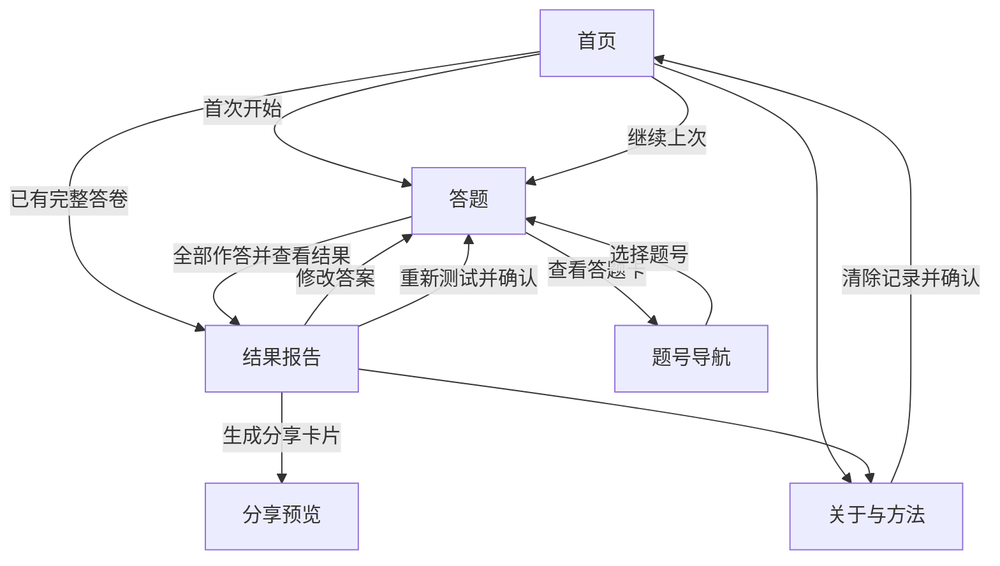

# TypeMe：手机与 PC 网页人格测评工具开发文档

> 版本：1.0 · 日期：2026-09-15 · 面向：接手开发的 dsh / 开发者 / 验收者。
> 本轮交付：开发方案与页面重新设计规格，未实施页面重构。用户已明确要求“整体体验都需要重新梳理”“页面也要重新设计”。
> 状态：Passed（方案完整性检查通过；不代表产品已实现或通过运行验收）。

## 0. 给接手开发者的执行摘要

**在现有 TypeMe 工程内，完成一个手机操作顺手、PC 排版舒展、测评结果易懂的中文网页工具。** 产品让用户完成四维人格倾向自测，得到四字母类型、四维偏好解释、日常情境建议，并保存结果卡片。

### 0.1 本次方案的决定

1. 延用 Vue 3 + TypeScript + Pinia + Vite 前端，以及现有 Java 21 / Spring Boot 内容服务；不另起工程，不更换技术栈。
2. 第一版只提供现有 OEJTS 1.2 的 32 题；约 5 分钟是预估文案，需要实际试用校准。不开设虚假的“专业版/完整版”入口。
3. 手机和 PC 都采用“一次展示一题，选择后点下一题”；取消当前按屏幕宽度自动决定是否跳题的行为。
4. 结果页按“结论 → 四维解释 → 日常表现 → 可行动建议 → 方法说明”组织。贴近中点时，结论区立即体现不确定性。
5. 作答和计分留在浏览器；保留刷新恢复；只保留最近一次本地会话，不增加账号、数据库、支付、广告、排行榜或云端分享结果。
6. 保留现有 GET 接口与领域计分公式。**首页、答题页、结果页、关于页和分享预览均重新设计**，包括布局、视觉层级、组件样式、移动端交互；不是只在现有页面上改 CSS。同步改造状态恢复、分享可靠性与必要内容措辞。
7. 交付必须有真实浏览器操作证据及手机、PC 截图。单元测试或构建通过不能代替页面验收。

### 0.2 文档优先级与授权

- 本文是**本次体验重构的目标规格**；旧 `docs/需求文档.md`、`docs/技术方案.md`、`docs/任务拆解.md` 保留为历史背景。
- 本文明确列出的范围和交互决定覆盖旧文档同一事项的冲突口径；未涉及的内容先核查现有实现，不机械照搬旧文档。
- 用户尚未指定商业化或官方量表授权，本方案沿用当前项目的非商业定位。这是可修订的产品假设，不是永久限制用户的业务选择。
- 页面重构不授权提交、推送、部署、删除用户工作或向外发送结果；这些操作须有对应指令。
- 本文不要求固定代理数量、固定开发轮数或新的工作流系统。开发者可自主拆分任务，但验收标准必须保留。
- 第 15 节可直接复制给 dsh。先完成真实的三页主流程，再扩展完整内容和异常路径。

## 1. 当前工程事实与重构理由

以下为 2026-09-15 的文件检查结果。源码支持的结论与体验设计判断分开记录；本轮没有启动网站进行 UI 实测。

| 事项 | 已核实事实 / 文件位置（相对项目根目录） | 本次处理 |
|---|---|---|
| 前端 | `frontend/package.json`：Vue 3、Pinia、Vue Router、Vite、Vitest 已存在 | 复用，不增加通用后台组件库 |
| 后端 | `backend/pom.xml`：Java 21、Spring Boot 3.3.5；复制 frontend/dist 到打包资源 | 保持现有架构；版本升级不属于本次范围 |
| 页面 | `frontend/src/views/`：Landing、Quiz、Result、About 四页 | 重做结构和体验，保留核心路径 |
| 路由 | `frontend/src/router/index.ts` 使用 hash history | 保留 `/#/`、`/#/quiz`、`/#/result`、`/#/about` |
| PC 宽度 | `App.vue` 统一容器；`tailwind.config.js` 的 shell 为 56rem | 按页面设置最大宽度，避免所有内容都挤在同一窄列 |
| 答题差异 | `QuizView.vue`：手机选择后 240ms 自动前进，桌面手动 | 两端改为显式下一题；不再有自动跳题计时器 |
| 进度 | `stores/quiz.ts`：`typeme.quiz.v1`，存答案、位置、时间；版本只记录 quick | 增加可验证的题库快照，避免同名 quick 更新后套用旧答案 |
| 内容 | 后端三个 YAML；`scripts/gen-fallback-content.mjs` 生成前端副本 | YAML 为维护源；不分别手改两份内容 |
| 计分 | `domain/scoring.ts` 使用符号与常量；`clarity.ts` 使用距离分档 | 保留数值，修正把距离当作稳定性或置信度的文案 |
| 分享 | `utils/shareImage.ts` 已有原生 Canvas 绘图和降级逻辑 | 复用；核验真实产图、下载、取消、错误路径 |
| 历史审查 | `docs/review-fix/复审结论.md` 有部分修复及未核实记录 | 仅作为回归线索，不视为当前仍存在或已经修复的事实 |
| 版本控制 | 根目录 `git status --short` 返回非 Git 仓库 | 无法据 Git 区分既有改动；实施前自行检查，不初始化 Git、不清理目录 |

### 1.1 旧口径需要纠正

- README 的“纯前端、零后端”与现有 Java 服务不一致。应描述为“浏览器本地计分，后端提供只读内容，可用内置内容降级”。
- “不收集作答就没有任何隐私义务”“IP+端口可以规避备案”均不得作为实施依据。开发文档只规定本次不上传作答；公开部署时另按实际日志、托管和服务方式核实。
- 官方在线演示当前说明包含 60 个项目，本项目依据的是**可下载的 OEJTS 1.2、32 题版本**；不能以在线演示题数自动扩展本项目。[官方 PDF](https://openpsychometrics.org/tests/OJTS/development/OEJTS1.2.pdf)、[在线演示](https://openpsychometrics.org/tests/OEJTS/)。
- “S–N 是全行业天花板”“分数高就说明稳定”超出了当前项目可证明的内容；不得作为首页卖点。
- 不把“MBTI 官方测评”当作本项目名称。建议正式标题：**TypeMe · 四维人格倾向自测**；介绍中可说明适合想了解 MBTI 四维类型的用户，并清楚说明采用 OEJTS，非官方 MBTI 测验。

### 1.2 体验问题的设计判断

现有工程已经有可复用基础，本次目标不是堆更多页面。重点是：统一操作预期、减少首屏解释负担、让用户知道下一步、让结果读起来有层次，并补齐恢复/取消/失败等状态。上述属于设计判断，实施后需用实际页面和试用验证。

## 2. 产品目标与范围

### 2.1 用户需要完成的任务

- 第一次来：快速理解“测什么、需要多久、是否收费、结果能看什么”，可以直接开始。
- 正在作答：看懂两端描述，轻松选择，能回改，离开再回来不必全部重做。
- 已答完：一眼看到自己的四维组合，了解哪些偏好明显、哪些接近两侧均衡。
- 看完结果：获取具体但不过度断言的日常建议，能够保存图片或复制文字。

### 2.2 必须完成 / 暂不实现

| 优先级 | 范围 |
|---|---|
| P0 | 首页、32 题作答、答题卡回改、完成确认、结果报告、进度恢复、手机与 PC 布局、基本无障碍 |
| P0 | 正确计分、边界说明、本地存储异常、题库版本隔离、内容降级、16 型有效内容、来源署名 |
| P1（本次完整交付仍需完成） | 分享图预览/下载/系统分享降级、复制文字、方法与隐私说明、清除本地记录 |
| 后续独立版本 | 多套长题库、账号、历史对比、类型百科独立站、AI 聊天报告、恋爱匹配、社交广场、收费报告、广告 |

不在第一版加入没有内容的占位入口。P0/P1 是开发顺序，不是允许省略 P1。

### 2.3 总体验收结果

新用户能从首页进入，完成 32 题、回改一题、查看正确结果并打开分享预览；中途刷新能恢复；API 不可用时仍能完成已加载的测评；手机无横向滚动、固定按钮不遮挡内容；PC 页面宽度和信息结构适合大屏。全部成立才叫主流程完成。

## 3. 信息架构与状态流



### 3.1 页面入口规则

- 首页：读取并校验本地记录后确定按钮；记录未完成显示“继续测试 · 已答 n/32”；完整则显示“查看上次结果”。
- 直接访问答题页：有效草稿恢复到 `currentQuestionId`；无记录从第 1 题开始；题目加载失败显示错误状态与重试。
- 直接访问结果页：完整合法会话显示结果；有缺答显示“还差 n 题”及“继续答题”；无记录显示“先完成一次测试”。不要来回自动重定向。
- 从结果点“修改答案”：进入答题卡，保留所有答案；改动后旧报告立即标为待重新生成，不能继续分享旧结果。
- 浏览器后退：页面导航不会自动清空进度；返回首页仍可继续。
- 导航“开始测试”：有草稿时等同继续，有完整答卷时先到首页，由用户选择查看结果或重测，不能悄悄重置。
- 未知 hash 路由：返回首页；未知问卷版本：显示“不支持的测试版本”，不伪装成快速版。

### 3.2 状态表

| 状态 | 用户看到什么 | 可做什么 | 不得发生 |
|---|---|---|---|
| 初始化 | 首页正常布局；按钮区轻量准备状态 | 查看说明 | 整页白屏、虚假题数 0 |
| 内容准备好 | 开始 / 继续 | 进入答题 | 同一次作答中途换题库 |
| 作答中 | 当前题、选项、进度、下一题 | 选择、回改、答题卡 | 自动选中中立、自动提交 |
| 全部答完 | “已答完 32 题”与“查看结果” | 查看、继续检查 | 强制立刻跳到结果 |
| 结果可用 | 类型、四维、解释 | 分享、回改、重测 | 结果与答案不是同一份 |
| 存储不可用 | “本次仍可作答，关闭或刷新后进度可能丢失” | 内存中继续 | 假称“已保存” |
| 数据不兼容 | 简短说明；重新开始选项 | 确认重开 / 返回 | 用新题库解释旧答案 |
| 生成分享失败 | 可重试提示、复制文字入口 | 重试、关闭 | 提示“已保存到相册” |

## 4. 视觉与响应式规格

### 4.1 设计方向

风格：**奶白与墨蓝的编辑式自我探索网站**，用少量杏橙点缀建立识别度。旧版纸白深青配色及同质卡片布局不再作为设计约束。通过大标题、非对称首页、安静的答题工作区、分层结果报告形成新版体验。正文以中文无衬线字体为主；结果四字母可用现有展示字体。字体先采用设备可用字体，不为风格引入阻塞中文首屏的远程字体。

首页可使用四组抽象线条/形状表达四维差异，使用本地 SVG 或 CSS；不依赖外站头像、网络字体或第三方人物插画。结果页的视觉焦点是类型与倾向，不能让装饰挤掉正文。

### 4.2 设计变量（首版默认值）

| 项目 | 值 / 规则 |
|---|---|
| 页面背景 | `#F7F6F2` |
| 内容表面 | `#FFFFFF`；次级背景 `#EEEDE7` |
| 主文字 / 次文字 | `#1D2D3A` / `#52616B` |
| 主色 | `#264E70`；悬停 `#1D3C57`；浅底 `#EDF2F6` |
| 点缀色 | `#B85332`；浅底 `#FAEDE5`；用于少量序号、图形和提示 |
| 分割线 | `#DCDDD7`；不依赖低对比边框作为唯一交互标识 |
| 提示色 | 背景浅杏，文字 `#7D3B26`；不确定性用普通提示，不一律红色警告 |
| 间距 | 4 / 8 / 12 / 16 / 24 / 32 / 48 / 64px |
| 圆角 | 控件 12px，题卡 20px，结果主卡 24px |
| 正文 | 手机 16px / 行高 1.65；PC 16–17px / 1.7 |
| 辅助说明 | 常规 14px，署名最低 12px；核心说明不缩成脚注 |
| 首页标题 | 手机 32–36px；PC 48–56px；中文自然换行 |
| 题目两端文字 | 手机 18px；PC 22px；长文本允许增高 |
| 类型代码 | 手机 52–60px；PC 72–88px |
| 主按钮 | 手机高 52px；PC 高 48px；触控区域至少 44×44px |
| 动效 | 淡入/状态过渡 120–180ms；不增加测评等待；支持减少动效偏好 |

以上是产品设计值，实施时实测文字与背景对比度；普通文字目标至少 4.5:1，焦点与关键控件边界至少 3:1。不能只因颜色表存在就声称无障碍通过。

### 4.3 断点与容器

| CSS 视口宽度 | 首页 / 结果页 | 答题页 |
|---|---|---|
| 320–767px | 单列，左右留 16px；320px 必要时降为 12px | 一题一屏为目标，长题/低高度允许自然滚动 |
| 768–1023px | 容器约 720px；结果主体保持单列 | 单题卡居中，答题卡放抽屉 |
| 1024–1439px | 容器最大 1120px；首页双栏；结果可带目录 | 容器最大 1120px；左 240px 进度，右弹性题卡 |
| ≥1440px | 容器最大 1200px；结果正文约 760px + 240px 目录 | 继续最大 1120px；不把题干拉成长行 |

首页、答题页、结果页各有容器规则，不把 `App.vue` 一个 `max-width` 套给全部页面。1920px 两边适度留白正常；禁止以“消灭所有留白”为目标无限拉宽正文。

### 4.4 通用行为

- 首页与结果页按正常文档滚动；不要全局禁止滚动或用固定高度截断。
- 手机答题页底部操作条使用安全区留白；正文预留操作条实际高度及至少 16px 空隙。
- 使用动态视口单位时保留兼容回退；地址栏收缩、横屏、200% 缩放后内容仍可到达。
- DOM 顺序与阅读顺序一致。PC 两栏不能导致键盘先跳过题目去页脚。
- 弹窗可 Esc 关闭，焦点留在弹窗内，关闭回触发按钮；底层不可误操作。抽屉标题必须可读。
- 链接、按钮、选项有 hover/focus/active/disabled；选中态至少包含边框、填充、勾选或文本，不能只有颜色变化。

### 4.5 每个页面的新版设计任务

| 页面 | 新版构图 | 视觉重点 | 手机变化 |
|---|---|---|---|
| 首页 | 左侧大标题与操作，右侧四维原创抽象图；下方开放式三项价值介绍 | 标题与主按钮是第一焦点，装饰让位于内容 | 标题/按钮先出现，装饰缩为局部图形，不占一整屏 |
| 答题页 | 移除营销式导航和长页脚；进度侧栏 + 中央大题卡 | 当前两端陈述、选中反馈、下一题 | 顶部轻量进度，底部固定操作；题号网格改为抽屉 |
| 结果页 | 墨蓝封面区 + 白底四维总览 + 开放式内容章节 + 目录 | 四字母和一句话结论，不确定维度紧邻展示 | 报告单列；目录变横向章节按钮，可换行 |
| 关于页 | 清楚的文章标题、引言、分节正文和页内锚点 | 可查证的来源和容易理解的说明 | 单列阅读；记录管理作为独立区块 |
| 分享预览 | 中性遮罩、图片居中、底部独立操作栏 | 真实生成图片；按钮与图片边界清楚 | 图片适配可见区域，操作不遮挡图片，长按区域可用 |

首页四维原创图形规格：在约 420×360px 的浅色区域内，放置四条粗细适中的曲线/轨道及几何端点，每条旁有“精力/信息/决策/节奏”小标签；属于装饰，不表现虚构的个人分数。手机将其缩为约 120px 高的局部装饰或放到首屏以下。可以用 SVG 实现，不复制竞品人格人物形象。

结果封面：桌面约 260–320px 高，左侧代码/描述，右侧四维关键词；手机高度随内容自然增长。墨蓝背景上使用白色主文字和足够对比的浅色辅助文字。若四维均衡，封面标题改为“你的四个维度都接近均衡”，兼容类型代码在次级区域解释。不能为了保持大字母造型弱化这一提示。

### 4.6 组件外观和状态交付

- 主按钮：实心墨蓝、白字、12px 圆角；次按钮白底边框；危险重置按钮只在确认弹窗突出，正常页面不抢主操作。
- 选项：未选白底深色标签；悬停浅蓝；选中浅蓝填充、墨蓝双像素边框和勾选标识。五档大小一致，不暗示某个答案更理想。
- 题目陈述：开放留白区或细线分区，避免两端都像“正确答案按钮”；真正交互集中于五档选项。
- 维度条：统一墨蓝标记与中点刻度，名称、方向、强度都用文字解释；四维不必各用一种饱和颜色。
- 内容章节：标题、细分割线、短列表为主；仅在摘要、行动建议、来源提示处使用卡片，不连续堆叠十余个同形矩形。
- Loading：用真实加载状态、局部骨架或按钮小图标；骨架尺寸接近最终内容，避免首屏跳动；结果计算不加假等待。
- 错误态：标题、原因概述、一个首要恢复按钮；技术堆栈不展示给用户。
- 空态：无历史时只显示开始引导；不展示空图表、0% 倾向或未知人格代码。
- 页面与导出卡片共用新版语义色、字体角色及文案规则；修订 `shareImage.ts` 内部旧颜色，避免网页与图片像两个产品。

### 4.7 设计完成的判据

开发者应先实现可运行页面，再按第 13.4 节产出手机/PC 对照截图。逐页检查主次层级、长文排版、首屏操作、空态/错误态和缩放适配。截图不能只截最漂亮的首页；答题和结果必须同样完成设计。若沿用旧模板仅换色、缩放字号或增加外边距，本次页面重设计不算完成。

## 5. 首页详细规格

### 5.1 内容顺序与确定文案

1. 顶部：TypeMe Logo + “关于测试”。手机首屏不塞四五个导航项。
2. 主标题：**从日常选择，认识你的性格偏好。**
3. 副标题：**回答 32 个简短问题，看看你在精力、信息、决策和生活节奏上的倾向。**
4. 信息行：`32 道题` / `约 5 分钟` / `免费 · 无需登录`。
5. 主按钮：`开始测试`；存在进度时使用第 3 节规定的动态文案。
6. 按钮下说明：`选择更接近平常状态的答案，没有标准答案。`
7. 来源短注：`基于 OEJTS 1.2，非官方 MBTI 测验。`；可展开署名/许可，不在首屏塞法律长段落。
8. “你会得到什么”：四字母参考类型、四维倾向解读、日常观察与建议，三个简短项目。
9. 结果示例卡：明确标“示例”，使用 INFP 示例内容；不能冒充用户已有结果，不能显示虚假人数或准确率。
10. FAQ：结果是否固定、答案是否上传、测试中断怎么办。每项短答，默认折叠。
11. 页脚：来源署名、许可链接、方法与本地记录管理入口。

首屏目标：390×844 和 1440×900 下，无需滚动即可看到标题、耗时、题数和主按钮。320×568 允许正常滚动，不靠缩小文字硬塞。

### 5.2 草稿和重测

- 草稿卡只在有合法记录时出现：`上次已答 12/32 题`、`继续测试`、次级链接 `重新开始`。
- 完整记录：主按钮 `查看上次结果`，次级 `重新测试`。
- 重新开始涉及覆盖当前本地记录，弹窗：`重新开始会替换这台设备上保留的上次作答，是否继续？`；按钮 `保留记录` / `重新开始`，默认焦点在保留。
- 正常首次开始不弹确认；不要求手机号、昵称、性别、生日或隐私勾选才可答题。
- 按钮连续点击时只初始化一次会话；首页异步恢复完成前不得显示会清空记录的可用“开始”按钮。

### 5.3 结构示意

```text
PC：首页容器 1120–1200px
┌ TypeMe                                      关于测试 ┐
│ 从日常选择，认识你的性格偏好。  │ 原创四维抽象图       │
│ 说明、32题、约5分钟             │ 或标注“示例”的结果卡 │
│ [开始测试]  来源短注            │                      │
├ 你会得到：参考类型 / 四维解读 / 日常建议 ──────────────┤
│ 常见问题                                              │
└ 署名与方法                                            ┘

手机：首页单列
TypeMe                                  关于
主标题 → 简介 → 题数/耗时 → [开始测试]
来源短注 → 你会得到 → 示例 → FAQ → 页脚
```

## 6. 答题详细规格

### 6.1 题卡

- 顶部：退出到首页、`第 n / 32 题`、已答数量和进度条。
- 题卡提示：`哪一侧更接近平常的你？`。
- 两端陈述用并排、等权重的两个文本区域。严格保持 `textLeft` 对应 1、`textRight` 对应 5，不因字母极点或视觉美观调换位置。
- 五个选项：`明显偏左`、`有些偏左`、`两边相近`、`有些偏右`、`明显偏右`，分别保存整数 1–5。
- 两端描述和选项属于同一个题卡，不让用户滚回上方才能回忆描述。
- 390px 下五个选项一行等分，每个有效点击区至少 44px 宽；标签可折行。320px 下仍保留顺序，不能隐藏中间选项。
- 无默认答案。中间选项表示两侧相近，不表示未作答。

### 6.2 导航与提交

1. 两端统一**手动下一题**；选项点击只更新当前答案与保存状态。
2. 当前题没答时“下一题”不可用，旁边固定短提示“先选择一个位置”；选中后即启用。
3. 上一题保留原选择；第 1 题不允许退到第 0 题。
4. 答题卡可跳到任意题，允许用户跳过暂不确定的题；最后提交统一检查全部必答。
5. 第 32 题按钮为“查看结果”。缺答时显示“还差 n 题”及“去补答”，定位第一道未答题。
6. 全部已答但正在回改前面的题：保留“下一题”，并出现稳定的次级“查看结果”入口。
7. 交卷先同步验证、计算；成功后保存完成状态并导航。禁止假装远程 AI 分析，不加 3–5 秒假进度。
8. 同一轮重复点击提交不能触发多次导航或生成多份记录。
9. 每 8 题允许一行提示：`已完成四分之一`、`已完成一半，可随时回改`、`还剩 8 题`。不加独立中场页面。
10. 进度条 = 合法已答题数 / 总题数，不使用当前题号代替完成量。

### 6.3 答题卡

- 手机：底部操作条中的“答题卡”打开抽屉；PC：左侧常驻题号网格。
- 32 个题号固定顺序。未答、已答、当前题有可区分外观及 accessible name，例如“第 12 题，已答，当前题”。
- 点击题号后关闭手机抽屉、定位该题标题；不得改动答案。
- 显示 `已答 20 / 32` 和 `去第一道未答题`。无需显示每题分数或 E/I 暗示。
- 手机抽屉推荐最大高度 75dvh，内部可滚动；不能遮住关闭按钮。

### 6.4 键盘与辅助技术

- 首选原生 radio + label；自定义时遵循 [W3C Radio Group Pattern](https://www.w3.org/WAI/ARIA/apg/patterns/radio/)。
- Tab 进出组选项；方向键在选项中移动并选择；Space 选择；方向键在组选项内不能同时切换题目。
- 数字 1–5 可作为附加快捷键，但输入框、编辑区域、弹窗打开、组合输入、Ctrl/Alt/Meta 组合时不拦截。
- Enter 激活当前聚焦按钮；不设置会在 radio 选中同时自动交卷的全局 Enter 处理。
- 换题后焦点到题目标题，播报题号；保存提示使用轻量 live region，避免每次选项都反复朗读长文。
- 不通过新增键盘快捷键改变触屏行为。

### 6.5 答题布局示意

```text
PC
┌ TypeMe                                      暂时离开 ┐
│ 已答 12/32  │ 第 13/32 题                             │
│ 进度条     │ 哪一侧更接近平常的你？                   │
│ 1 … 8      │ [左侧陈述]                 [右侧陈述]   │
│ 9 … 16     │ [1]    [2]    [3]    [4]    [5]         │
│ 17 … 24    │                                         │
│ 25 … 32    │ [上一题]                      [下一题]  │
└────────────┴─────────────────────────────────────────┘

手机
← 首页                         第 13/32 题
已答 12/32 ━━━━━━━━━
哪一侧更接近平常的你？
[左侧陈述]                    [右侧陈述]
[1]    [2]    [3]    [4]    [5]
对应文字标签、保存状态
底部：[上一题] [答题卡] [下一题] + 安全区
```

## 7. 题库与计分规则

### 7.1 内容来源和边界

维护源：`backend/src/main/resources/content/questionnaire-quick.yml`。保留 32 个题号、每维 8 题、左右端、方向符号和常量。不把题改成普通“同意/不同意”量表，不随机左右端，不额外补 12 或 28 道 AI 自拟题。

量表许可与原始公式以 [OEJTS 1.2 PDF](https://openpsychometrics.org/tests/OJTS/development/OEJTS1.2.pdf) 为依据；许可要求参见 [CC BY-NC-SA 4.0](https://creativecommons.org/licenses/by-nc-sa/4.0/)。产品沿用非商业用途，保留作者、来源、许可链接和中文改编说明。商业用途属于独立范围变更，不能直接把当前题库接上付费或广告。

题干措辞若只是标点/排版修订，可按现有内容流程处理；涉及意思、文化语义或极向变化时，单列题号、原文、修改理由，不在视觉重构中偷偷替换。本轮没有完成中文量表信效度验证。

### 7.2 数值契约

有效答案为 1–5 的整数，必须按题号对应。领域维度键固定为 `EI/SN/TF/JP`，原文 IE/FT 与代码 EI/TF 仅命名顺序不同。

```text
每维得分 = scoring.constants[维度] + Σ(question.direction × answer[question.id])
阈值判断：score > midpoint 取 E/N/T/P，否则取 I/S/F/J。
拼接顺序：EI → SN → TF → JP。
```

独立核验表（用于测试，业务代码仍由题库驱动）：

| 维度 | 常量 | 正号题 | 负号题 | 得分 >24 / ≤24 |
|---|---:|---|---|---|
| EI | 30 | 15,23,27 | 3,7,11,19,31 | E / I |
| SN | 12 | 4,8,12,16,20,32 | 24,28 | N / S |
| TF | 30 | 6,10,22 | 2,14,18,26,30 | T / F |
| JP | 18 | 1,5,13,21,29 | 9,17,25 | P / J |

每维理论范围 8–40，中点 24。恰好 24 按兼容规则仍分到 I/S/F/J，但 UI 必须表达“两侧均衡”，不能只展示一个确定标签。

### 7.3 强度与倾向条

- `distance = abs(score - 24)`。
- `intensity = round(distance / 16 * 100)`，展示为 `倾向强度 25/100`，不写“你有 25% 的概率是 I”。
- 双极条位置 `position = (score - 8) / 32 * 100%`，左端为 I/S/F/J，右端为 E/N/T/P；中线为 50%。
- **position 与 intensity 是不同数值**。score=20：位置 37.5%，强度 25，偏左侧；score=28：位置 62.5%，强度同样 25，偏右侧。
- 固定用一个标记点显示位置，中线可见；强度放辅助文案或展开详情。不把整个进度条涂满后让人误读为人群占比。
- 领域层 `clarity` A/B/C/D 字段保留兼容；前台统一称“本次倾向”，无需突出字母等级。

| 距离 d | 兼容等级 | 用户文案 | 含义 |
|---|---|---|---|
| ≥9 | A | 较明显 | 本次得分离中点较远 |
| 5–8 | B | 中等 | 本次偏向一侧 |
| 2–4 | C | 轻微 | 两侧特征均可参考 |
| 0–1 | D | 接近均衡 | 不宜只按当前字母理解 |

这是产品展示分档，不是经过统计验证的置信区间、正确率、稳定性或回答一致性指标。修订 `clarity.ts` 中“比较稳定”“方向很一致”等超出距离计算含义的解释。

### 7.4 必须固定的验算样例

| 输入 | EI | SN | TF | JP | 类型 / 展示 |
|---|---:|---:|---:|---:|---|
| 全部选 1 | 28 | 16 | 28 | 20 | ESTJ |
| 全部选 3 | 24 | 24 | 24 | 24 | 兼容码 ISFJ；首要文案“四个维度都接近均衡” |
| 全部选 5 | 20 | 32 | 20 | 28 | INFP |
| 正号题选 1、负号题选 5 | 8 | 8 | 8 | 8 | ISFJ；强度均 100 |
| 正号题选 5、负号题选 1 | 40 | 40 | 40 | 40 | ENTP；强度均 100 |
| 全 3，仅 Q3 改为 2 | 25 | 24 | 24 | 24 | ESFJ；EI 仍接近均衡 |
| 全 3，仅 Q3 改为 4 | 23 | 24 | 24 | 24 | ISFJ；EI 仍接近均衡 |

全选 1 不等于每维最低分；全选 5 不等于每维最高分。测试预期不能从被测函数现场计算。

## 8. 结果报告详细规格

### 8.1 内容层级

1. **结果主卡**：`你本次的倾向组合`、四字母、原创描述名、一句话画像；存在 C/D 的字母附清楚标记。
2. **即时边界提示**：例如 `I/E 两侧接近，请结合下方两种表现理解。`。全中立结果优先提示均衡，四字母降为辅助。
3. **四维总览**：精力方向、信息偏好、决策依据、生活节奏；每项包括两端名称、位置条、倾向文本、两句解释。
4. **日常表现**：3 条具体情境，覆盖沟通、学习/工作、日常安排；标题“这些情境，你可能比较熟悉”。
5. **优势与提醒**：各 3 条，强调适用情境；提醒不是缺陷判决。
6. **可以尝试的小行动**：2 条，每条包含场景和可执行行为。
7. **操作区**：生成分享卡片、复制结果文字；修改答案、重新测试为次级操作。
8. **折叠说明**：怎么看这些数字、为何会变化、来源与方法；详细长文放 About。

手机结果首屏（390×844）至少出现代码、名字、结论短文以及四维区的开头。PC 主体约 760px，右侧目录/分享操作约 240px；不把所有段落装进一模一样的小卡。

### 8.2 四维解释模板

| 维度 | 两端显示 | 解释重点 | 不允许的简化 |
|---|---|---|---|
| EI | 内向 I ↔ 外向 E | 独处与外部互动的偏好 | 内向等于社恐、外向等于领导力 |
| SN | 实感 S ↔ 直觉 N | 具体经验与可能性/模式的偏好 | S 不聪明、N 脱离现实 |
| TF | 情感 F ↔ 思考 T | 价值与人际影响、原则与逻辑权衡 | F 不理性、T 没感情 |
| JP | 判断 J ↔ 感知 P | 提前确定安排与保持灵活的偏好 | J 自律成功、P 懒惰失败 |

例如 score(EI)=20：`本次略偏内向 I`；`你可能更愿意先独处整理想法，再进入讨论。外部互动也可能让你受益，场景和状态会影响选择。`

C/D 维度同时显示另一侧描述，不能仅在页尾放免责声明。多个维度接近中点时，不列出 8/16 个候选类型让用户迷失，不伪造“第二可能类型 31%”。

### 8.3 内容维护契约

沿用 `types.yml` 的现有 `code/nameCn/tagline/dimensions/strengths/blindSpots/resonance/growth` 结构，不为页面改版增加接口字段。

- `nameCn`：建议采用下表原创描述名；全站一致，四字母始终是主标识。
- `tagline`：约 25–50 个汉字，表达日常偏好，避免“天生”“注定”“最稀有”。
- `dimensions`：四个维度完整，单项约 40–80 字；倾向较弱时由页面补充均衡提示，不由类型长文覆盖它。
- `resonance`：3 条，每条约 30–60 字，分别落在明确情境；不要写所有人都赞同的赞美。
- `strengths`、`blindSpots`：各 3 条，每条约 20–45 字。
- `growth`：2 条，每条约 40–70 字，今天或本周能执行。
- 以上字数是编辑目标，可因句意调整；不得为了凑字数重复表达。

### 8.4 16 型内容方向表

下表是本次建议的内容方向，不代表经过验证的个体预测。正文优先审校现有内容，按该结构改写；不要求复制外部平台人格角色。

| 代码 | 描述名 | 内容聚焦 | 建议行为方向 |
|---|---|---|---|
| INTJ | 系统规划者 | 独立推演、长线方向、系统改进 | 提前与相关人核对约束 |
| INTP | 概念探索者 | 概念关系、逻辑追问、开放探索 | 给探索设置一个可交付节点 |
| ENTJ | 目标组织者 | 目标拆解、协调资源、推动决策 | 决策前主动听取不同顾虑 |
| ENTP | 可能性发起者 | 新视角、观点碰撞、试验 | 为一个方案安排小规模验证 |
| INFJ | 意义洞察者 | 理解动机、长远意义、价值连接 | 把期待转成可直接表达的请求 |
| INFP | 价值探索者 | 内在价值、体验细节、表达空间 | 将重要想法拆成很小的一步 |
| ENFJ | 共识推动者 | 理解他人、形成共识、协作 | 确认自己的时间与责任边界 |
| ENFP | 灵感连接者 | 兴趣探索、人和机会的连接 | 选定当周最值得完成的一件事 |
| ISTJ | 稳健执行者 | 事实、责任、可重复流程 | 为变化留一个可调整的窗口 |
| ISFJ | 细节照顾者 | 具体需求、可靠支持、经验积累 | 说清自己能提供支持的范围 |
| ESTJ | 秩序组织者 | 清楚分工、执行标准、进度 | 区分必要规则与可协商规则 |
| ESFJ | 协作照顾者 | 群体协调、实际帮助、关系维护 | 帮忙前先询问对方的真实需要 |
| ISTP | 实践拆解者 | 现场观察、动手排障、独立处理 | 用简短记录让别人理解思路 |
| ISFP | 体验表达者 | 当下体验、个人价值、具体表达 | 用一种具体作品表达想法 |
| ESTP | 行动试验者 | 即时反馈、情境应对、快速尝试 | 行动前检查一个关键后果 |
| ESFP | 活力参与者 | 真实互动、现场体验、即时支持 | 给长期事项设置轻量提醒 |

### 8.5 完整文案样例：INFP

**说明：仅是内容风格样例；页面上的代码和数值必须由真实答案生成。**

- 名称：价值探索者。
- 一句话：你可能习惯先确认一件事对自己意味着什么，再寻找一种既真诚、又保留空间的参与方式。
- EI：相较于持续互动，你可能更喜欢先留一点独处时间，把感受和想法整理清楚，再选择愿意分享的人。
- SN：你可能会留意事情背后的可能性与含义。面对具体任务时，也可以主动寻找事实来验证自己的理解。
- TF：做决定时，你可能比较在意选择是否符合重视的价值，以及它会怎样影响相关的人。
- JP：你可能希望给想法留出变化的空间。必要时，用少量明确节点帮助自己把探索转成行动。
- 情境一：小组讨论临时征求意见时，你可能想先理清自己的感受，散会后再补充一段更完整的想法。
- 情境二：任务有多个做法时，你可能会问“哪种方式更符合我在意的事”，再比较效率和成本。
- 情境三：周末安排上，你可能会留一段没有具体计划的时间，跟随当时的兴趣行动。
- 优势一：在需要理解个人感受的交流中，可能注意到容易被忽略的细节。
- 优势二：当任务与你重视的价值相连时，可能愿意深入探索。
- 优势三：面对表达任务时，可能有耐心寻找更贴切的说法。
- 提醒一：等待“完全想清楚”时，可能错过先试一小步的机会。
- 提醒二：含蓄表达需求时，对方未必能准确理解你的期待。
- 提醒三：选择太多时，可能需要额外帮助自己确定当前优先级。
- 行动一：挑一件近期在意的事，写下今天 15 分钟内能完成的一步，完成后再决定是否继续。
- 行动二：下次需要他人支持时，尝试用“我在意的是……我希望你能……”直接表达一个具体请求。

内容验收：16 型齐全、代码唯一、每个字段不空；同时人工检查四字母方向和正文一致。全文重复检查是辅助，不能仅用关键词或字数检查宣称原创性/内容质量通过。

## 9. 分享、保存与再次作答

### 9.1 分享卡片

- 沿用 Canvas，默认实际输出 **1080×1920 PNG**；不额外再乘 2。低内存设备允许降为 540×960，并仍保证文字可读。
- 内容：TypeMe、四字母、描述名、tagline、四维简化条、必要的均衡提示、`仅供自我了解`、来源作者与许可标识及可读来源/许可地址。
- 不包含逐题答案、姓名、设备信息、内部会话 ID。首版不生成分享码、远端结果地址或假二维码。
- 分享卡片数据取当前报告快照；生成期间发生回改时，取消旧产物或标记失效，不能把旧图片作为新结果分享。
- 生成前校验报告完整；成功必须检查 Blob 非空、图片可解码、宽高正确。`data:,` 或 null Blob 属于失败。
- 文本换行按绘制宽度测量；两端文字、类型说明不能裁断。最长内容实际导出一次检查。

### 9.2 用户操作

1. 点击“生成分享卡片”→ 生成中按钮防重复 → 弹出图片预览。
2. 预览中分别提供“下载图片”“系统分享”（能力支持时）和“复制文字”。
3. 浏览器文件分享必须检测能力，并在用户点击时触发；HTTPS/安全上下文和浏览器支持是条件，参见 [MDN Web Share](https://developer.mozilla.org/en-US/docs/Web/API/Navigator/share)。
4. 下载后提示“已发起下载，请查看浏览器下载记录”；系统分享成功只能提示“已交给系统分享”。网页无法可靠证明用户已保存到相册。
5. 用户取消系统分享是中性结果，不弹错误警告。
6. 不支持下载/系统分享时保留图片预览与“可尝试长按图片保存”；在用户目标浏览器实际检查，不保证所有内置浏览器都支持。
7. 剪贴板失败时显示可手动选择的纯文本；复制成功后才提示“已复制”。
8. 分享失败不清空答卷、不离开报告。预览关闭和组件卸载时释放 Object URL。

复制文字模板：`我在 TypeMe 的本次倾向组合是 INFP。部分维度可能接近均衡，结果仅供自我了解。` 有确定站点地址时可以附首页地址，不能附带含答案的 query/hash。

## 10. 状态、数据和兼容实现

### 10.1 继续复用的模块

| 模块 | 职责 | 改造边界 |
|---|---|---|
| `domain/scoring.ts` | 校验、得分、字母、强度 | 保留算法；只做必要的类型兼容或防御性校验 |
| `domain/clarity.ts` | 距离分档、解释 | 保留阈值；修订用户解释 |
| `domain/answers.ts` | 答案有效性 | 统一题号和值的规范化口径 |
| `stores/quiz.ts` | 会话、当前位置、完成与恢复 | 增加快照、完成状态、存储状态，避免散在各页面 |
| `api/client.ts` | GET 内容、超时、验证、fallback | 保留端点；完善身份校验及请求结束边界 |
| `content/*` | 构建生成的内置内容 | 不手改生成数据；包装代码与生成文件按实际脚本区分 |
| `components/*` | 题卡选项、倾向条、分享预览等 | 能复用就改造；不要复制同一计分/极点映射 |

`App.vue` 负责公共壳与导航，不持有计分和恢复规则。具体文件拆分由开发者决定，不要求为每个 UI 区块创建文件。

### 10.2 本地会话 v2

建议新键 `typeme.quiz.v2`；以下是内部数据设计，不是新增后端接口：

```ts
interface LocalQuizSessionV2 {
  schemaVersion: 2
  questionnaire: Questionnaire       // 本次实际使用的完整32题快照
  questionnaireSignature: string     // 下述规范序列化结果，用于精确一致性比较
  answers: Record<number, number>
  currentQuestionId: number          // 保存题号，避免仅依赖数组下标
  startedAt: number
  updatedAt: number
  completedAt: number | null
  reportProfile: TypeProfile | null  // 完成时采用的类型文案快照
}
```

签名由固定顺序字段构成：version、questionCount、scoring 的四维常量/中点，以及按 id 排序后的 `[id,textLeft,textRight,dimension,direction]`，规范 JSON 序列化后直接比较字符串。它用于内容一致性，不是安全认证，不依赖联网或安全上下文加密能力。

- 每次有效选择后立即更新内存并尝试存储；切题更新当前位置。数据量小，无需复杂持久化框架。
- 读取按 unknown 校验：对象形状、有限时间戳、合法题库、当前题号、答案值及题号归属；限制单条记录大小，建议 128KiB，超限走可恢复错误。
- 本地快照仍须满足本项目支持的 32 题及符号/常量规则，不能只因有快照就信任任意题库。
- 答案中的额外题号丢弃；非法答案视为未答并提示补答；不能产生看似完整的报告。
- `reportProfile.code` 必须等于重算 typeCode；正文结构校验失败则回落有效内置文案，明确重建报告状态。
- 不把缓存的 typeCode 或得分当作权威，结果始终从快照与合法答案重新计算。
- 用户改动答案即清除 `completedAt/reportProfile`；重新查看结果后生成新报告。分享缓存一并失效。
- `storageStatus`（成功/不可用/冲突）保留在 store 运行态；实际写成功才显示“已保存到此浏览器”。

### 10.3 旧记录与更新

- v1 的 `version=quick` 不足以证明题库内容没变，不能无提示迁移到新内容。
- 发现 v1 时保留旧键，提示“发现旧版作答，无法确认题库是否一致；重新开始将使用当前题库”。确认重新开始后才删除该应用的旧键；取消则不改记录。
- v2 草稿恢复时沿用经过校验的旧题库快照完成本轮；内容服务更新不替换本轮题目。
- 新测评开始才选择最新可用题库。已有完整结果沿用保存的合法题库和类型文案快照。
- 新客户端不再支持该快照时，显示版本不兼容；用户可以返回或确认重开，禁止拿当前 quick 强行计算旧答案。
- “清除本地记录”只删除 TypeMe 的 v1/v2 应用键和内存状态，不执行 `localStorage.clear()`。
- 不定时删除记录；用户主动清除或确认重测时替换。About 中说明“保留最近一次作答，直到你清除或重新测试”。

### 10.4 多标签页

首版不要求自动合并两份答案。监听 storage 事件；另一标签页更新、重测或清除时，本页停止自动覆盖，提示“另一页面已更新这次测试，请载入最新进度”。按钮“载入最新进度”经校验后替换本页状态。未处理冲突前禁用写入/交卷；失败可返回首页。不能静默以旧答案覆盖新结果。

## 11. 内容服务、网络与方法页

### 11.1 现有接口不变

| 请求 | 用途 | 必须验证 |
|---|---|---|
| `GET /api/v1/questionnaires/quick` | 获取本次题库 | 请求版本等于响应版本；32 题与所有计分字段合法 |
| `GET /api/v1/types/{code}` | 获取一种类型文案 | 响应 code 等于请求 code；16 型之一；完整字段 |
| `GET /api/v1/meta` | 站点与署名信息 | 结构合法；不得把站点 contentVersion 当作题库唯一身份 |
| `GET /api/v1/method` | 方法说明 | sections 与 attribution 可用 |
| `GET /actuator/health` | 服务健康检查 | 单独根路径；不是 `/api/v1/actuator/health` |

没有提交答案、创建报告、用户登录接口。正常答题不触发逐题网络请求；结果页可获取静态类型解释，答案与分数不进入请求参数、body、日志或第三方分析。

### 11.2 加载策略

- 首页内容本身立即可渲染；允许预取题库。题库准备中，开始按钮有明确状态。
- 内容请求总等待预算建议不超过 1500ms，然后采用**同版本**有效内置内容；这是新体验预算，不是本轮测得的现状。
- 一个请求必须有真实总超时；不能因 signal 不兼容进行无期限重试。开发环境兼容分支也要受总预算限制。
- 多个调用共享正在加载的题库 Promise；完成/失败后清理状态。快速离开页面后，晚到响应不能覆盖新会话。
- 选择 API 或 fallback 后，本轮固定数据；超时后的迟到 API 响应不得在答题中替换快照。
- API 正常与 fallback 两条路径都要运行验证。内置内容不可用时展示可重试错误，不生成空题目。
- fallback 不需要用“服务端挂了”等技术通知干扰用户；在 About 的信息区可以查看内容版本。
- “断网可继续”限于页面及内容已经加载的会话；没有 Service Worker 时，不承诺关闭页面后离线重新打开网站。

### 11.3 About 的四个部分

1. **如何作答**：平常状态、左右端含义、没有标准答案、可以回改。
2. **如何理解结果**：本次偏好、连续分数、接近中点、类型不是固定身份；展示简化公式，细节可折叠。
3. **来源与限制**：OEJTS 版本、作者、链接、许可、中文改编说明；不沿用全行业准确性结论或其他量表信度来证明本产品。
4. **本地记录**：保存内容、保存位置、保留范围、不会上传的作答字段；“清除本地记录”按钮及确认反馈。

统一隐私表达：`题目答案与计分在你的浏览器中处理。为方便继续测试，本浏览器会保留最近一次作答，你可以随时清除。` 不写“完全不存储任何数据”。公开服务是否记录 IP 等访问日志须按部署实际补充，不能由前端文案代替核实。

来源及署名使用可点击链接，外链与正文区别明显。当前 API 是 classpath YAML，改内容通常需要重新打包/重启，不能承诺存在尚未实现的在线内容后台。

## 12. 实施工作包与完成判据

开发者可以按实际依赖调整拆分，不得把以下每个工作包都当成需要用户批准的一轮。

| 工作包 | 结果 | 主要涉及 | 依赖 | 完成证据 |
|---|---|---|---|---|
| A 范围与基线 | 知道现状、保护原文件、确认可用命令 | package/pom/docs/现有测试 | 无 | 基线运行结果、已有失败与本次新增问题分开记录 |
| B 页面样式与主流程 | 首页/答题/结果在两个端都有完整信息层级 | App、style、views、组件 | A | 真实 32 题流程、手机/PC 三页截图 |
| C 会话和恢复 | 刷新、回改、重测、版本不兼容、跨标签页行为可靠 | store、answers、client | A；与 B 对齐事件 | 状态测试和浏览器故障路径 |
| D 结果与内容 | 16 型内容完整、均衡表达正确、条形与分数对应 | Result、DimensionBar、YAML | B/C | 16 型检查、极端/均衡样例、人工内容检查 |
| E 分享与说明 | 图片真实可用、取消/失败不假成功、记录可清除 | shareImage、Result、About | D | 真实输出图、复制/失败验证、浏览器矩阵 |
| F 收尾与交付 | 构建产物可访问，既有正确能力不退化 | 文档、构建、测试 | B–E | 验收矩阵、命令结果、已知限制、实际产物截图 |

### 12.1 第一段实现必须形成的可见结果

先做可运行的“首页开始 → 一题交互 → 真实 32 题提交 → 真实结果”及手机/PC 布局；用真实数据验证结构，不做仅有占位文字的漂亮静态图。达到后继续补完整内容、状态与分享。

如果构建成功但用户仍看不到入口、手机按钮被挡、报告依旧长篇堆叠，应继续修正页面，不能通过增加后台功能宣称已完成。

### 12.2 实施后文档同步

将 README 改为实际架构和运行方式；为旧三份文档增加简短“本次体验改造以新方案为准”的提示，保留历史内容。不要删除 `research/`、`_research/`、`_osint/` 或用户既有产物。文档同步属于实施工作，本次方案生成尚未改动它们。

## 13. 验证与验收

### 13.1 命令与执行顺序

以下是**后续实施时执行的命令**。Windows 使用 npm.cmd；版本以锁文件和现有工程为准，不为了完成文档引入升级。

```powershell
# 根目录：先检查现有生成副本是否与维护源一致（只检查，不写）
node scripts/gen-fallback-content.mjs --check

# 前端目录：有依赖则复用；缺少时按现有 lock 安装
Set-Location D:\develop\develop\code\TypeMe\frontend
npm.cmd ci
npm.cmd run typecheck
npm.cmd test
npm.cmd run build

# 本地开发预览；仅监听本机
npm.cmd run dev -- --host 127.0.0.1

# 前端构建通过后，在另一终端验证后端及组合产物
Set-Location D:\develop\develop\code\TypeMe\backend
mvn test
mvn package -DskipTests
java -jar target/typeme-backend-1.0.0.jar --server.address=127.0.0.1
```

- `npm test/build` 的前置脚本会重新生成前端内容；应先执行 `--check` 留下基线，再生成。先生成后检查，不能证明此前没有漂移。
- `npm ci` 会重建依赖目录，仅在需要准备依赖时执行，避免重复消耗时间。
- `build:only` 跳过类型检查及标准预构建链，不能作为完整构建通过证据。
- Maven 会复制 frontend/dist，必须先成功构建前端；不能启动旧 target jar 冒充新实现。
- 已有端口被占用时使用空闲本机端口并记录地址，不停止未知进程。
- 浏览器与 API 只读验证应覆盖 `/#/`、`/#/quiz`、`/#/result`、`/#/about` 以及 health；健康检查不能证明答题和分享可用。
- 本地预览不等于公开发布；不要自动执行部署命令。

### 13.2 算法与状态测试

| ID | 操作/输入 | 必须观察到 |
|---|---|---|
| ALG-01 | 第 7.4 节七组向量 | 分数、类型与预期一致 |
| ALG-02 | 少一题、0、6、小数、NaN、未知题号 | 不按完整答卷计分；有效题保留、错误有明确处理 |
| ALG-03 | d=0/1/2/4/5/8/9/16 | 分档边界正确；输出不含置信度承诺 |
| ALG-04 | 单个题答案从 2 改为 3 | 仅所属维度按 direction 改变 1 分 |
| ALG-05 | 16 型各一组合法极点答案 | 类型方向、对应文案、页面字母一致 |
| STATE-01 | 答 12 题刷新 | 12 题及当前位置恢复，题库相同 |
| STATE-02 | localStorage 抛异常/满配额 | 仍可完成本次答题；提示未持久化 |
| STATE-03 | 坏 JSON、超限记录、坏题号、坏答案 | 页面不崩；不假装恢复成功 |
| STATE-04 | 同为 quick 但内容不同 | 草稿继续用合法快照，新测使用新内容 |
| STATE-05 | v1 记录 + v2 页面 | 未确认前保留 v1，不偷偷转换/删除 |
| STATE-06 | 两标签页改动或清除 | 冲突提示；旧页不自动覆盖新记录 |
| STATE-07 | 查看结果后回改 | 旧报告/图片失效；新结果重算 |
| STATE-08 | 不完整答卷直达 result | 留在可操作的缺答状态，没有路由循环 |
| NET-01 | API 断开、500、坏结构、超时 | 对应版本 fallback 可用；超时后不偷换题库 |
| NET-02 | 请求 INFP 返回 ENTP 内容 | 拒绝不匹配响应，使用有效 INFP 副本 |
| NET-03 | 连续进入页面、离开后响应到达 | 不重复恢复、不覆盖新会话 |

不必给每个颜色或纯文案写单元测试。新增测试集中在上述真正影响正确性和状态的行为。

### 13.3 浏览器操作验收

| ID | 场景 | 通过标准 |
|---|---|---|
| UX-01 | 首页首次访问 | 首屏主按钮清楚，能识别题数和预估时间 |
| UX-02 | 同一题连续改选 | 留在本题，最后一次选择生效，无延迟跳题 |
| UX-03 | 上一题与答题卡往返 | 已选答案不丢，题号/进度正确 |
| UX-04 | 跳过多题到最后 | 缺答数量正确，“去补答”可定位 |
| UX-05 | 键盘完成作答 | 焦点清楚，组选项方向键不切题，能交卷 |
| UX-06 | 32 题全选中立 | 结果强调四维均衡，兼容码不冒充确定判断 |
| UX-07 | 浏览器返回、重测取消 | 本地记录保留，没有隐式清空 |
| UX-08 | 弹窗开关 | 焦点进入/返回正确，Esc 有效，底层不可误点 |
| SHARE-01 | 最长文案生成图 | 图可解码、实际尺寸正确、中文不裁断 |
| SHARE-02 | 文件分享成功/用户取消 | 状态如实反馈，没有“已保存相册”误报 |
| SHARE-03 | Blob 为空/Canvas 失败 | 可重试或复制文字，结果仍在 |
| SHARE-04 | 剪贴板被拒绝 | 可手动选取复制，不假成功 |
| PRIV-01 | 答完整个流程并检查网络 | 无逐题答案、分数、记录内容外发 |
| PRIV-02 | 清除本地记录 | 仅 TypeMe 记录被清除，其他应用键保留 |

### 13.4 设备与截图矩阵

- 桌面实际浏览器：Windows Chrome / Edge；记录版本。关键窗口：1280×720、1440×900、1920×1080。
- 手机布局模拟：320×568、375×667、390×844、430×932；补测 844×390 横屏、768×1024 平板。
- 真机目标：iOS Safari、Android Chrome 各一次完整流程，重点看滚动、底部安全区、存储和保存图片。
- 模拟窄屏只能证明布局和对应浏览器内核行为，不能替代 iOS Safari 真机验收。无真机时记录“未验证”，其余独立工作继续完成。
- 微信等内置浏览器不作为第一版专用适配目标；如果测试覆盖了就记录结果，不能擅自保证朋友圈直发或所有相册能力。
- 必交截图至少 8 张：手机/PC 首页各一张、手机/PC 答题各一张、手机/PC 普通结果各一张、均衡结果一张、分享预览一张；另交实际导出的图片文件。
- 截图使用明确的测试答卷；记录视口、浏览器、步骤及预期。不能用设计稿截图替代运行截图。

### 13.5 性能与可用性目标

- 作为设计目标：选项点击反馈和切题在本机正常环境下应即时可感知，通常不超过 100ms；实际测量与环境一起记录。
- 网络内容准备受总预算控制；不能出现无限 loading。首次已加载会话完成测试不依赖后续题库请求。
- 不为首页插画引入大资源、远程字体或重型动效库；维持现有依赖规模。
- 检查控制台未捕获异常；检查 200% 缩放和最长中文题目；所有操作可到达，无横向溢出。
- 不把一次 Lighthouse 分数、构建耗时或单元测试速度写成人格测评效果指标。

## 14. 风险、开放项与本轮证据

### 14.1 已作默认决定，可继续实施

- 使用现有非商业 32 题基础，不等待更多题库研究。
- 两端手动下一题、保留最近一次本地记录、原创描述名、奶白墨蓝与杏橙点缀的新版视觉。
- 不新增接口、不用云端 AI 生成报告、不开展商业部署。
- 如果后续用户另有品牌偏好，可调整视觉；不因此推翻计分和恢复规则。

### 14.2 仅在范围改变时需要重新决定

- 要收费/投广告/用于组织筛选：先解决题库授权、产品用途和实际数据处理方案，不直接接入当前功能。
- 要官方 MBTI 测评或宣称测量准确性：需要相应授权及有效证据；本项目代码或公式正确无法满足这一要求。
- 要长版题库、历史数据云同步或公开个人结果链接：另定义题库、计分、接口、删除与访问边界。
- 公开发布地址、HTTPS、服务器日志保留尚未由本次请求确定；不阻塞本地开发，发布前另核实。

### 14.3 本轮实际完成的核验

- 已阅读现有四页、路由、公共布局、计分、分档、进度、接口降级、分享实现及内容生成机制。
- `node scripts/gen-fallback-content.mjs --check`：通过，前端生成副本与后端 YAML 一致。
- 使用现有只读内容加载函数，独立代入全选 1/3/5：分别得到 `[28,16,28,20]`、`[24,24,24,24]`、`[20,32,20,28]`。
- 在线核对官方 32 题 PDF 的公式、阈值及许可；核对 W3C radio 键盘规则和浏览器分享 API 条件。
- 本轮没有改业务源码、运行完整测试、生成新网页或发布服务；已有 target/dist/历史测试报告不作为本次功能通过证据。

### 14.4 参考依据

- [OEJTS 1.2 原始 PDF：题数、公式、阈值、许可](https://openpsychometrics.org/tests/OJTS/development/OEJTS1.2.pdf)
- [OEJTS 开发文档：来源背景与许可](https://openpsychometrics.org/tests/OJTS/development/)
- [CC BY-NC-SA 4.0：署名、非商业及相同方式共享](https://creativecommons.org/licenses/by-nc-sa/4.0/)
- [W3C Radio Group Pattern：键盘和语义](https://www.w3.org/WAI/ARIA/apg/patterns/radio/)
- [MDN navigator.share：能力、用户触发与安全上下文](https://developer.mozilla.org/en-US/docs/Web/API/Navigator/share)

访问核验日期：2026-09-15。外部材料用于限定来源与行为边界，不等于本项目中文翻译或结果内容已获得心理测量验证。

## 15. 可直接交给 dsh 的执行指令

```text
请在现有 TypeMe 项目内实施 docs/2026-09-15/TypeMe-整体体验重构开发文档.md。

这次目标是整体体验重构，支持手机和 PC。保留当前 Vue 3 / Java 内容服务、32 题
OEJTS 计分基础、现有 GET 接口和浏览器本地作答方式。

重点执行：
1. 按文档第4节重新设计首页、答题、结果、关于及分享预览：新版布局、奶白墨蓝视觉、
   组件状态和手机/PC排版都要落地，不能只在旧页面上换色或调整边距。
2. 手机与 PC 统一手动“下一题”，保留回改、答题卡和缺答补答。
3. 结果先讲清倾向，再展开方法；全中立与接近中点不显示为确定结论。
4. 完成题库快照、本地进度恢复、旧记录兼容、跨标签页冲突、分享真实成功/失败处理。
5. 题目及类型文案以 backend 的 YAML 为维护源，前端副本走现有生成脚本。

先检查项目规则和当前文件，保护已有工作。先记录基线与生成副本一致性，再实施。
优先形成真实三页流程，随后补全内容、恢复和分享，不另起工程、不增加后台系统。
普通实现细节自行决定；仅范围、权限或业务含义发生变化时请求决定。

完成后按文档第13节执行测试、构建、浏览器流程及手机/PC截图验收。
汇报实际命令和结果、页面截图、导出图片、未验证设备与剩余问题。
不要把构建成功当成体验完成，不要引用旧测试报告充当本轮证据。
未经相应授权，不提交、推送、部署、删除已有资料或向外发送内容。
```

### Workflow Brief

- task：依据本文完成 TypeMe 手机/PC 整体体验重构。
- scope：现有工程内实现页面与必要状态改造；保留 32 题与接口；不含提交、发布、云存储或商业化。
- evidence：第 1 节源码地图、第 7 节数值契约、第 14.3 节本轮检查；旧文档只作为历史线索。
- next：核验当前文件与基线命令，然后完成工作包 B 的真实三页流程并继续 C–F。
- state：本轮只生成开发文档，尚未实施重构。
- verification：内容副本检查与三组独立算术复核通过；未运行页面和完整测试。
- open：没有阻塞本地实现的必答问题；真机与公开发布环境按实际可用性补验。
