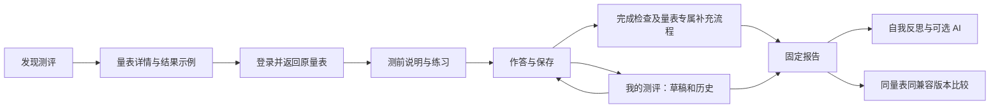
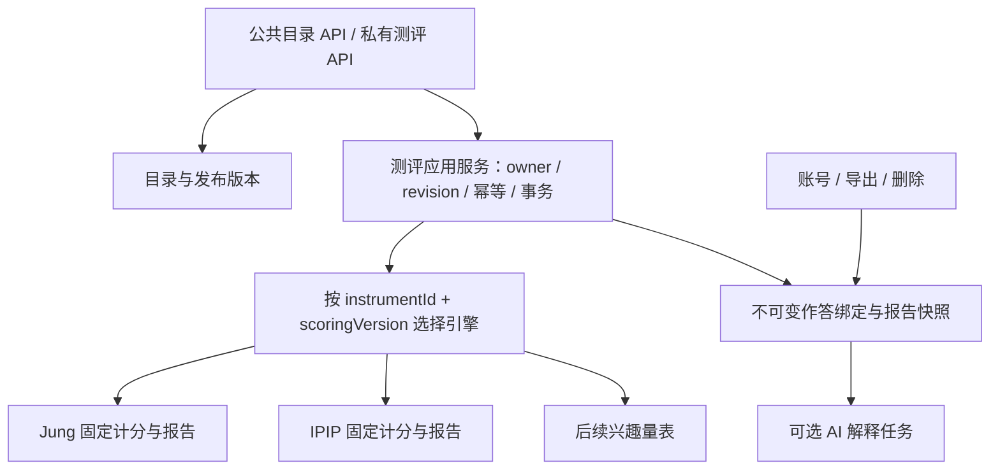

# TypeMe 多测评平台整体改造方案

日期：2026-09-18。性质：基于当前工作区的架构评审、计分核验与实施方案；不是已实施变更或上线验收。

**交给另一位 AI 时**：配套阅读[示例与任务说明](给实施AI的示例与任务说明.md)。其中包含完整用户故事、首页草图、题目改写对照、四种状态报告、大五示例、AI 输入输出、版本/并发案例及可复制的实施说明。示例是设计材料，不是已发布契约或真实测评数据。

## 1. 建议采用的方向

把 TypeMe 从“十六型测评站”改成“帮助用户从不同角度认识自己的测评平台”。统一发现测评、作答保存、历史记录、报告访问、账号与数据管理；每种量表保留自己的题目、计分、解释和证据边界。

首版建议正式支持两条完整流程：**十六型人格参考测评 + 大五人格倾向测评**。第二批考虑 RIASEC 职业兴趣；它的中文适配、许可条件和验证需要先完成，不能仅下载英文题目后宣布上线。OEJTS 保留历史兼容，不作为新平台主推内容。

保留 Vue 3、TypeScript、Pinia、Spring Boot、JdbcTemplate、Flyway。后端改成模块化单体，先解决单量表绑定、版本解析、事务与安全边界；没有现有负载证据支持立即拆微服务、引入消息中间件或更换数据库。

**优先级：题目能理解且计分可信 → 固定报告与 AI 能读懂 → 平台领域边界 → 两种测评完整闭环 → 页面体验 → 第三种测评和内容运营。** 页面与平台接口可以交替迭代，但不能用界面完成代替测评验证。

用户新增反馈明确要求同时解决题目、固定报告、AI 分析看不懂的问题。具体内容样例、输出契约调整及真人理解验收见[题目报告与 AI 易读性改造](题目报告与AI易读性改造.md)。它属于核心改造范围；原工作量估计需在内容样板评审后重新校准。

本轮建议假设：中文成年人自我探索、登录后保存作答、不做招聘/诊断/配对判定、基础报告完整可用、AI 为主动选择。是否商业化、匿名作答、首发必须三种以上，属于可调整的产品决策，本方案不把它们视为已获授权的实施需求。

## 2. 评审范围与证据边界

已梳理前端入口/路由/样式、首页/答题/报告/历史比较、账号与旧本地流程，追踪 store → API → Controller → Service → 内容加载/计分/数据库迁移；检查 AI 输入/输出/任务、数据导出删除与安全规则。对新测 64 道题的题面和极性进行了通读，对核心 Java/TypeScript 计分做了定向运行核验。

这不等于逐行审计仓库每个文件，也不等于已验证全部生产路径。未连接数据库、未启动应用到现有库、未调用真实 AI、未进行真实用户心理测量研究；本轮没有运行整站浏览器验收。网页方案属于设计建议，不冒充现网视觉实测。

开始时已有 39 个受跟踪文件变更，以及多项未跟踪功能/测试/验收材料，涉及答题、账号删除、AI、幂等和页面。它们是当前评审输入，不作清理或回退。本轮只新增本目录方案和只读审计脚本。

配套：[计分审计与验证记录](计分审计与验证记录.md)、[可复现审计脚本](scoring-audit.mjs)、[本次脚本输出](scoring-audit-result.json)。

## 3. 当前架构判断

| 范围 | 当前证据 | 对改造的影响 |
|---|---|---|
| 新测目录 | `JungController` 只有 `/api/v3/catalog/current`；`JungPackageLoader` 固定当前包 ID 与 classpath 文件 | 改首页卡片不够，需要真正的量表目录与按版本解析 |
| 草稿 | `AttemptService` 创建/读取/保存/检查多处用 `loader.current()` | 有 package_id 不代表能继续任意历史版本草稿 |
| 内容校验 | Loader 同时校验四维、64 题、十六型文案与过程结构 | 应拆公共包校验和量表专属校验 |
| 计分 | `JungScorer` 已是纯函数，Java 权威，TS 预览 | 是可保留的核心；包装为版本化引擎，不需要重写成规则脚本 |
| 前端 | `instrumentV3`、`assessmentV3`、`reportV3` 依赖 Jung 维度/类型；报告解析强制四字母语义 | 单一“通用 ReportV3”无法直接承接大五 |
| 旧流程 | IPIP/OEJTS 使用本地 `quiz` 与旧报告/内容接口 | 新增服务端大五流程；旧本地记录继续走原版本 |
| 数据库 | package/attempt/report 表名已较通用，但含 clarification、computed_type_code 和 self_selected_type_code | 可渐进扩展，不必把所有历史数据复制到新库 |
| AI | `ReportInputBuilder` 固定 EI/SN/TF/JP，输出校验含十六型正则 | 任务执行能力可复用，输入与输出须按量表适配 |
| 安全 | 认证和 CSRF 特别匹配 `/api/v3/`，其余最终 permitAll | 新增 `/api/v4` 若不同时改安全配置，会产生暴露风险 |
| 导出/删除 | 账号服务直接枚举测评、报告、AI 表 | 增加表/附件/反思记录时必须同步数据生命周期 |
| 视觉 | 已有纸色、海军蓝、文字层级和移动端基础 | 保留可用设计资产，重建信息架构和页面职责 |
| 测试 | 新测共享夹具与过程推导测试存在；内容仍为 draft_review_pending | 工程一致性已有基础，语义审题和实证验证仍缺 |

### 3.1 应先处理的具体问题

1. **JP-02 题意与极性错配。** 左侧“先定下一套做法，往下推进”被标为 P，右侧“同时留着几套做法，看情况再说”被标为 J。依项目定义，左侧应偏 J、右侧偏 P。选择最左会产生 +2，实际贡献给 P。发布修复需新包，不能原地改已绑定版本。
2. **阈值规格漂移。** 产品/开发方案的 `|m|≤0.20` 与冻结契约/代码的 `|S|≤floor(0.2n)` 不等价。契约对边界缩小的解释与“证据不够明显”的理由自相矛盾；详见审计记录。
3. **量表扩展被当前包绑定阻断。** 当前读取不是按草稿固定包解析。不能把 `CURRENT_PACKAGE_ID` 改成新版本就认为完成多版本支持。
4. **新接口版本的鉴权风险。** 迁移必须先补新路径授权及 CSRF 测试，然后暴露新控制器。
5. **创建草稿的事务和幂等存在源码风险。** `create()` 同类调用标有 `@Transactional` 的 `createOnce()`；默认 Spring 代理不能拦截这种自调用。资源创建与幂等 complete 分开且后者失败只告警，存在响应记录缺失后的恢复问题。这里是源码风险，不声称已经在线复现重复记录。应以崩溃窗口/重试故障注入验证。[Spring 代理机制](https://docs.spring.io/spring-framework/reference/core/aop/proxying.html)
6. **元信息漂移。** `frontend/package.json` 描述仍为旧 32 题流程；路由注释还含旧默认量表说明。重构时按最终产品统一 README、包元信息、页脚、方法页、许可清单。

## 4. 测评内容与科学性策略

### 4.1 十六型：保留探索价值，修正证据表达

当前项目是原创 Jung 四维问卷，不是官方 MBTI 题库或官方算法。官方产品有自己的计分和验证研究，不能把它们的信度指标移植到本项目。独立研究也对“天然离散的十六种人”提出过实证质疑，因此报告应以连续维度为主、四字母为参考摘要。[官方产品资料](https://www.themyersbriggs.com/en-US/Support/Validity-of-the-Myers-Briggs-assessment)、[McCrae 与 Costa 原始研究，1989](https://onlinelibrary.wiley.com/doi/10.1111/j.1467-6494.1989.tb00759.x)

建议新版本：

- 前台名称继续用“十六型人格参考测评”，详情页说明与 MBTI 的关系和区别。
- 保留 `REFERENCE/TENTATIVE/TIED/NEEDS_REVIEW` 在该量表中的专属语义；平台层不强迫其他量表使用这些状态。
- 固定计分、补充题规则和阈值都版本化；`REFERENCE` 不包装成“确定类型”。
- 显示维度位置与有效回答数量，位置不是准确率、人群百分位、能力或概率。
- 四字母推导的过程结构放在进阶阅读，不作为第二组测得分数；保留 basis 和局限提示。
- 自我选择另存，不能覆盖问卷结果。官方 best-fit 也强调个人核对，但本产品不能因此自称官方过程。[官方 best-fit](https://www.myersbriggs.org/unique-features-of-myers-briggs/best-fit-type/)
- 缺少实证之前不新造“信心 92%”、IRT 参数、AI 动态出题或人群排名。

### 4.2 大五：优先接入现有 IPIP-50，但重新核验中文版本

IPIP 官方允许公有领域材料用于商业或非商业目的，且计分键与正反计分公开。标准五档中，正向为 r，反向为 `6-r`，每维求和。50 题对应五个十题维度；当前使用情绪稳定性 ES，不应直接改标签为神经质却不反转解释。[IPIP 许可](https://ipip.ori.org/newPermission.htm)、[计分说明](https://ipip.ori.org/newScoringInstructions.htm)、[五因素键表](https://ipip.ori.org/newBigFive5broadKey.htm)

实施要求：

- 逐题建立英文源条目、中文题面、维度、正反键、来源的对照，不只检查 50 道数量正确。
- 本仓库中文为自写改写稿；不能把英文原量表证据作为这个中文版本已验证的证明。
- 大五展示五条连续维度，不拼四字母，不输出唯一“人格类型”。
- 首版不做群体百分位；解释使用问卷区间、个人作答与限制说明。
- 保留旧缺答政策：未完成维度不补中点，不借用 Jung 的 9/12 门槛；新服务端版本明确完成规则与是否允许部分报告。
- 新服务端流程使用独立发布版本；旧 `ipip50-zh1` 本地报告不因迁移自动变成服务端核验报告。

### 4.3 职业兴趣：第二批 RIASEC

建议候选为 O*NET Interest Profiler，输出 Realistic / Investigative / Artistic / Social / Enterprising / Conventional 六类兴趣及解释。兴趣不等于能力，不等于职业录用条件。O*NET 提供不同形式和官方手册；本项目需明确选择具体短版，不自行删题凑“极速版”。[官方介绍](https://www.onetcenter.org/IP.html)、[技术手册入口](https://www.onetcenter.org/reports/IP_Manual.html)

原样复制与修改采用不同许可路线；中文翻译适配不能当作原样复制。官方开发者许可要求对纳入其内容的产品进行验证，并作相应署名及修改声明。职业数据库许可与量表许可也需分开核对。[官方许可](https://www.onetcenter.org/license_tools.html)

第一版只做兴趣剖面和探索问题，不直接把美国职业列表当作中国职业建议。职业映射需另做本地职业资料、解释依据与维护责任设计。

### 4.4 暂不纳入首版的类别

九型、依恋、优势、价值观等可以进入选型清单，但每种都应先完成来源、许可、中文版和解释范围评审；不以“网上流行”作为上线依据。临床筛查类另立产品与专业评审项目，不复用娱乐参考报告模板。

### 4.5 每种量表的上线档案

每个 release 必须有：目标人群、用途/不适用用途、原始来源、许可及中文改编权、题目清单和计分键、缺答规则、算法版本、报告版本、审校记录、验证证据、限制说明、发布人与撤回政策。内容状态与可见状态分开：草案、内部审校、试测、可公开使用，不把结构校验通过叫作“科学验证通过”。

验证分层推进：题意专家复核 → 目标用户认知访谈 → 试测与项目分析 → 信度/重测/结构与外部效度 → 跨群体适用性。样本量由研究设计和估计精度决定，不能用一个小样本人数作为通用上线标准。中文适配参考 ITC 指南。[ITC 测验翻译与适配指南](https://www.intestcom.org/files/guideline_test_adaptation_2ed.pdf)

## 5. 网站信息架构与页面重构

导航建议：**发现测评 / 我的测评 / 方法与依据 / 账号**。桌面水平导航，手机保留简洁导航；作答页进入专注布局，不与首页营销内容共用重型页头。



### 5.1 首页：从单一测评宣传页改为发现页

首屏标题建议：“从不同角度，认识自己。”副标题说明“人格偏好、性格特质与兴趣探索；每份报告都说明依据与局限”。不同时摆大量空分类和“即将开放”卡片。

页面顺序：导航 → 一句话价值说明 → 已登录用户的继续作答 → 可用测评卡片 → 如何选择 → 报告示例 → 方法与隐私摘要。

卡片固定展示：名称、回答什么问题、适用场景、真实题量/补充上限、预计时间（未试测则标估计）、存储方式、证据与来源入口、开始/继续。两种测评时不急着做搜索；达到实际需要时再增加分类和筛选。

桌面内容区建议最大 1120–1200px，卡片两列；390/320px 单列。保留纸色与海军蓝，但不同量表靠名称和图形区分，不只靠颜色。普通用户不看 packageId/hash/开发状态字符串。

### 5.2 量表详情页：让用户知道自己在测什么

独立 URL `/assessments/:slug`。展示“能了解什么 / 不能说明什么”、真实示例、题量/时间、来源/版本的可读说明、数据处理方式、开始按钮。内容未完成试测时用人话说明限制，不输出内部状态枚举。

开始前登录，登录回到所选量表及版本，不丢失上下文。注册免责声明记录版本；选择 AI 另确认外发范围，注册勾选不作为无限外发授权。

### 5.3 答题页：统一交互，保留题型差异

公共骨架负责进度、保存提示、上一题/下一题、答题卡、离开恢复。首批题型只实现：双极五档、单句五档；未来题型通过明确组件扩展，不允许 JSON 执行 JS/Vue 模板。

- Jung 显示两端场景；大五显示单句与贴切度刻度，各自有练习题。
- 未答、说不好、中立三种状态在数据和视觉上都区分。
- 默认选后留在原题，显式下一题；回退可辨认已选答案。
- 保存提示只有服务端确认后才显示“已保存”；请求排队、未同步、冲突、登录失效各有独立状态。
- 409 显示两端更新事实，保留本地待保存内容；不能自动拿新 revision 强覆盖。
- 草稿缓存键至少包含 user/attempt/package，退出和切换账号清理内存与敏感缓存；异步响应需校验当前 owner 和 attempt。
- 补充题独立阶段计数，主测 48/48 不突然退回 48/64；大五不展示不存在的补充流程。
- 不在答题时显示当前字母方向，避免提示用户按期望类型调整答案；计分预览仅用于必要的完成检查。

### 5.4 报告页：统一导航，专属解释

首屏只解决“本次看到了什么、哪些地方还不明确、接下来可以做什么”。下方再展开维度、解释、行动、自我反思、方法、AI。

| 报告 | 首屏与图形 | 专属内容 |
|---|---|---|
| 十六型 | 参考类型或并列状态 + 四条双极位置 | 边界/补充题说明、候选、自我选择；过程结构折叠阅读 |
| 大五 | 五条同向刻度条 + 各维解释 | 每维独立解释、缺答标记、日常观察；不显示类型码 |
| RIASEC | 六类兴趣条形图 | 高兴趣并列、活动探索；不造就业胜率 |

优先条形图与文本，不把雷达面积当“人格总分”。统一页头/目录/导出入口，但各量表解释组件独立。页面、导出图片和文本共用同一经校验报告模型。

报告比较只在明确可比较的量表版本组内进行；不同题库或算法没有等值研究时，不显示数值趋势。不同测评可以并列阅读，不能把大五 E 换算为 Jung E，也不合成“综合人格分”。

### 5.5 我的测评、账号与管理后台

- `/my/assessments`：草稿、已完成、按量表筛选；多个不同量表草稿同时存在。
- `/reports/:id`：单报告详情；列表与详情从现 `ReportV3View` 拆开。
- `/reports/compare`：只提供可比较记录，解释禁用原因。
- `/account`：资料、安全、导出、注销；原安全反馈和恢复码流程保留。
- `/methods/:slug`：逐量表来源、算法、局限和版本说明；隐私、站点条款单独页面。
- 管理后台首版仅目录上下架、版本只读检查、来源与审校状态；题库发布仍走仓库审查和构建校验，不先做可随手覆盖正式题面的 CMS。

### 5.6 页面验收要求

320、390、1440px 真实浏览器检查：横向溢出、固定操作栏遮挡、长中文换行、滚动、焦点、键盘作答、弹窗焦点恢复、200% 缩放、减少动效。目标按 WCAG 2.2 AA 检查，主要按钮设计为至少 44px 高；颜色不作为唯一状态，保存消息通过适度的 live region 表达，不反复打断读屏。[WCAG 2.2](https://www.w3.org/TR/WCAG22/)

公开目录与详情如需要搜索引擎流量，可第二步引入预渲染或静态公开页面。私有作答/报告维持 SPA。仅把 hash 换为 history 不等于解决 SEO；要同时配置服务端回退、旧链接兼容和公开页元信息。[Vue 性能指南](https://vuejs.org/guide/best-practices/performance)

## 6. 前端模块设计

建议逐步形成以下职责，不一次搬完所有文件：

```text
app/                  路由、布局、会话初始化
features/catalog/     目录、详情、公开元信息
features/assessment/  attempt、保存队列、完成检查、答题骨架
features/reports/     历史、详情壳、比较入口
instruments/jung/     专属题面适配、预览、报告、候选、过程结构
instruments/ipip/     专属键值、报告和解释
features/account/     登录、安全、导出删除
features/ai/          通用任务状态 + 按量表输出适配
legacy/               原本地流程兼容边界
shared/               UI、API 传输、错误模型与格式化
```

目录 store 不再是单个 `instrumentV3.current`；使用 `catalogBySlug` 与不可变 `releaseById`。答题状态以 attempt 标识管理，切换路由时取消/隔离旧请求；不共享一个全站可变 activePackage 导致跨测评串题。

拆 store 按职责，不按文件行数：`attemptSession` 管当前服务端快照，`answerSync` 管串行保存/重试/冲突，`navigation` 管当前题，`completion` 管后端验证结果。保持现有已修复的防重复操作和会话失效逻辑。

报告采用有类型的联合模型：公共 envelope + `kind/schemaVersion` + 专属 payload；Jung 严格解析器继续校验 Jung，不能为了适配大五删除全部字段校验或改成任意对象。未知 schema 返回“暂不能读取此版本”而非套默认模板。

首版按路由及量表报告动态导入，避免首页加载所有类型文案和旧题库；性能是否改善用产物大小与浏览器测量验证。[Vue Router 懒加载](https://router.vuejs.org/guide/advanced/lazy-loading.html)

## 7. 后端架构：模块化单体 + 量表适配器



推荐模块：`catalog`、`assessment`、`report`、`instruments.jung`、`instruments.ipip`、`account`、`ai`、`security`、`common`。先使用 Java package 明确依赖，不为分包引入新框架。公共模块不 import Jung 枚举，量表模块实现公共端口。

建议公共端口（示意，不是本轮代码）：

```java
interface AssessmentEngine {
    EngineKey key(); // instrumentId + scoringVersion
    ValidationResult validate(ReleaseSnapshot release, AnswerSet answers);
    CompletionPlan plan(ReleaseSnapshot release, AnswerSet answers);
    ScoreResult score(ReleaseSnapshot release, AnswerSet answers, CompletionDecision decision);
}
interface ReportComposer {
    ReportSnapshot compose(ReleaseSnapshot release, ScoreResult score);
}
```

计分引擎不访问数据库、不调用 AI、不读当前用户或系统时间。应用服务负责授权、事务、读取固定版本、验证请求、持久化。缺答、补充题和结果状态属于量表政策，不在通用服务写 `if dimension == EI`。

“配置驱动”只覆盖经 schema 校验的题目、元信息与参数，不允许运营上传任意可执行公式。算法改变仍经代码审查、独立夹具与发布版本。

### 7.1 内容版本模型

区分五个概念：

1. `instrumentId`：测量工具身份，如 Jung48、IPIP50。
2. `releaseId/packageId`：用户实际作答的完整不可变发布快照。
3. `scoringVersion`：规则实现版本。
4. `reportSchemaVersion`：机器读取结构版本。
5. `reportContentVersion`：解释文案版本；若以后用常模，另记 normVersion。

新建 attempt 时由目录解析具体 release，然后始终按它加载。上下架只控制能否新建，不删除旧包/引擎/报告渲染器。已完成报告以存储快照读取，不能重算或用当前文案覆盖。

如错误题需要撤回：停止该 release 新建；旧报告保留原文与 hash，另加不改快照的版本问题通知；旧草稿根据问题严重度允许原版完成或提示开始新版，由明确政策决定，不静默替换题。

### 7.2 通用生命周期与并发

平台 attempt 建议只表达 `IN_PROGRESS/READY/SUBMITTED/ABANDONED` 等生命周期，Jung 的 BASE/CLARIFICATION 作为专属阶段；兼容层映射旧状态。`READY` 必须绑定当前答案 revision，修改答案后失效；客户端无法自行声明已经完成检查。

保存答案：验证 owner、固定 release、题号/题型/值、expectedRevision，在一个事务内 CAS 更新 revision 与答案；失败全部回滚。完成检查与提交重新读取服务端已保存答案，不相信前端分数。

提交：使用一致锁定/CAS 顺序，保证读到的答案与提交 revision 一致；报告插入、attempt 标为已提交、幂等结果完成同事务。保留 `UNIQUE(attempt_id)`，失败重放读取原报告而非再生成。

创建：将事务写入放进独立 bean 或 TransactionTemplate，避免同类自调用注解误判。幂等键绑定 user、operation、规范化请求指纹（含 instrument/release/baseReport）；同 key 不同内容 409。若需要独立 claim/lease，必须有资源 ID 预分配与崩溃恢复方案，不能依赖“complete 失败仅写日志”。

删除与 AI 返回的竞争：先撤销可访问性、取消任务，提交 AI 结果前再次检查 owner/删除状态；不能使删除的数据被晚到响应重新写回。当前清理重试机制必须保留。

## 8. 数据模型与迁移方案

首版两种量表都能复用已有 RATING/UNKNOWN 表结构，先不要为多选、自由文本、视频等未确定题型引入万能 JSON 答案。

| 对象 | 建议演进 | 不变量 |
|---|---|---|
| instrument_catalog（新增） | slug、名称、类别、默认 release、可用状态、来源说明 | slug 唯一；默认 release 必须属于该 instrument |
| assessment_package（保留扩展） | 保留快照/sha；增加必要 schema/渲染器标识或独立 release 元数据 | 同一 ID 不覆盖；运行期不自动改发布数据 |
| assessment_attempt（保留扩展） | 继续绑定 package；兼容现阶段字段，逐步加通用阶段 | owner、revision 与固定包不变 |
| assessment_answer（优先复用） | 五档适用于首批两量表；按包定义校验 | unknown 不补 3；题号不能跨包 |
| assessment_report（保留扩展） | 公共结果 envelope、专属 JSON、schema、hash | 一 attempt 一报告；大五类型码为 null |
| report_self_reflection（兼容） | 十六型自选保留；通用反思另加结构/表 | 不覆盖计算结果 |
| ai_analysis_job（演进） | 增加量表输出 schema、prompt/input 版本绑定 | 结果不能脱离 reportHash |
| 内容发布审计（新增或文件档案） | 来源、审校、发布/撤回记录 | 不包含作答原文和凭据 |

注意当前 `assessment_answer.question_id` 为 VARCHAR(16)，当前题型与 rating CHECK 为 1..5；新量表 ID/刻度必须提前核对。若需要更长 ID 或新刻度，在增量迁移中明确更改，不靠截断或复用 UNKNOWN 塞入其他含义。

迁移采用扩展 → 适配 → 验证 → 切换 → 延后收缩：

1. 固化当前 dirty 工作区的交付边界和测试基线；备份方案与恢复演练计划先准备好，实际操作另获授权。
2. 新增迁移，不改 V1–V8；新增字段先允许兼容旧行，唯一/非空约束在回填核验后收紧。
3. 保留 v3 路径，内部调用新应用服务；固定旧 Jung release，不把旧客户端隐式切到最新包。
4. 将现有 package 登记到目录与解析注册表；记录回填前后行数、孤立外键、重复 attempt-report、hash 一致性。
5. 新前端只对已准备好量表走新 API；旧链接仍能读历史报告。
6. 发布切换由 feature flag/default release 控制；回退入口不删除新数据。回退必须使用可读新 schema 的兼容版本，不能承诺任意旧 jar 都能安全运行。

不做长期双写两套报告表。也不在登录后自动上传旧 localStorage 数据。若未来提供导入，要用户主动操作、保留原包、校验内容与答案、标明“客户端历史导入”，不得冒充原始服务端计分记录。

## 9. API 契约草案

建议新接口 `/api/v4` 与 v3 并存；账号 v3 先保持稳定，避免一次改动登录与全部业务。发布 v4 前必须完成安全匹配改造。

| 方法与路径 | 语义 | 权限/关键约束 |
|---|---|---|
| GET /api/v4/catalog | 可用量表目录 | 公开，只返回公开字段 |
| GET /api/v4/instruments/{slug} | 介绍、方法、默认 release | 公开，不含草稿或用户数据 |
| GET /api/v4/releases/{id}/questionnaire | 按 release 取可作答内容 | 首版登录；受限内容不能因通用接口被公开 |
| POST /api/v4/attempts | 指定 instrument/release 新建 | 登录 + CSRF + 幂等键；服务端验证可新建 |
| GET /api/v4/attempts | 本人草稿/历史，分页过滤 | owner 固定为当前认证用户 |
| GET /api/v4/attempts/{id} | 原版本答案与进度 | owner 校验 |
| PATCH /api/v4/attempts/{id}/answers | 批量答案变更与进度 | expectedRevision；题号/刻度/状态校验 |
| POST /api/v4/attempts/{id}/review | 完成检查与专属追加计划 | 使用当前 revision；返回缺答/补充计划 |
| POST /api/v4/attempts/{id}/submit | 固定计分和报告快照 | expectedRevision、幂等、原子提交 |
| GET /api/v4/reports[/{id}] | 本人报告列表/详情 | 列表仅摘要；详情 no-store |
| GET /api/v4/reports/compare | 服务端核验比较资格 | 同 owner + compatible group |
| PUT /api/v4/reports/{id}/reflection | 个人反思 | 不变更计算字段或原报告 hash |
| POST /api/v4/reports/{id}/analysis | 自愿请求 AI 解释 | 外发范围确认、预算和输出 schema |

删除能力按现有 API 权限保留并在新模型补齐，DELETE 仍校验 owner/CSRF/状态。异常统一 errorCode/message/requestId/fieldErrors；保留 401、403、404、409、429、503 的可辨认语义。列表使用服务端分页，所有列表含量表和可读版本信息。

公共目录可使用 ETag/短缓存；私有报告和认证响应 no-store。新 API 不以难猜 UUID 代替鉴权。公开路径用明确 allowlist，私有 API 默认认证，未映射 API 默认拒绝，同时保证静态资源和旧 GET 契约可用。[Spring Security 授权规则](https://docs.spring.io/spring-security/reference/servlet/authorization/authorize-http-requests.html)

## 10. AI、隐私与内容运营

复用任务租约、额度、取消、重试与错误映射；每个量表注册 `AiInputProjector/OutputValidator`，不把 Jung 正则和四维字段推广成平台限制。

AI 输入优先固定报告摘要与用户主动选择的关注点；逐题证据如需外发应明确范围，不能默认发送全部原始答案。用户备注作为数据处理，不能拼接成系统指令。输出限定为解释、观察建议、提问，不允许重判类型、补常模或产生诊断结论。

AI 缓存/幂等指纹至少包含 owner、reportHash、量表、promptVersion、inputSchema、关注主题与备注摘要。不能跨用户复用个性化结果。关闭、超时、401 或配额不足时，固定报告始终可读；是否真实计费与请求已发但结果未知分开记录。

新表、新导出文件、新缓存都加入账号数据目录：保存什么、保存多久、导出是否包含、删除如何传播、失败如何重试。日志只记 requestId、量表版本、操作状态、耗时和脱敏错误；不记录密码、恢复码、答案正文或 AI 备注。

商业化前必须盘点实际分发产物中的 OEJTS 内容，包括前端 fallback、旧包、文档和图片；隐藏入口不等于停止分发。具体许可清理与保留历史阅读之间的安排要单独决定，当前不删除任何旧内容。[OEJTS 来源](https://openpsychometrics.org/tests/OEJTS/)

## 11. 验证与验收矩阵

| 层次 | 必测内容 | 放行依据 |
|---|---|---|
| 内容 | 题意/极性人工盲审、维度归属、原文对应、缺答政策、许可 | 签名审校表；不能只靠生成器 |
| 计分 | 手工金样、极值/中立/unknown、左右镜像、阈值两侧、随机差分 | 两语言与独立参考计算一致，保留版本 |
| 引擎扩展 | 两量表完整闭环 | 接入大五无需修改 Jung scorer 或强制四字母字段 |
| 服务 | CAS、幂等、事务失败/崩溃恢复、删报与 AI 竞争 | 业务不变量断言，无重复报告/丢答案 |
| 安全 | v3/v4 未登录、跨用户、CSRF、管理员、公开目录数据最小化 | 自动化负向测试；安全规则先于新路由上线 |
| 版本 | 旧报告读取、旧草稿继续、新包下架、未知 schema | 不重算、不覆盖、错误可解释 |
| 数据迁移 | 回填数量、hash、FK、唯一性、索引与回退兼容 | 授权环境演练记录；H2 不能代替 MySQL |
| 前端 | 请求乱序、双击、断网、409、会话变化、多量表切换 | store/component 测试 + 浏览器完整流程 |
| 视觉 | 320/390/1440、键盘、缩放、长文本、读屏状态 | 脱敏截图与操作记录 |
| 构建 | 前端 build 后再打 jar，核对静态资源 | artifact hash、资源清单、退出码 |
| AI | mock 成功/失败/无效结构/取消/晚到结果 | 固定报告不受影响；真实调用另获授权 |

新增回归用例优先用本轮真实发现的问题，而不是复制现有公式来证明公式本身正确。前后端共享夹具很好，但独立人工金样和题意审校必须成为第二条证据链。

## 12. 分阶段实施计划与交付物

以下为单个熟悉项目的全栈开发者的粗粒度净工作量估计，不含用户研究招募、外部授权和等待反馈；不是工期承诺。先完成第一阶段再根据实际复杂度修订。

| 阶段 | 主要工作 | 可验收交付 | 粗估 |
|---|---|---|---|
| P0 可信性与基线 | 逐题审校、阈值决策、版本冻结、脏工作区边界、风险复现 | 审校表、算法 ADR、独立金样、当前测试基线 | 3–5 人日 |
| P1 平台骨架 | 目录、release resolver、引擎端口、API 安全、事务/幂等梳理 | Jung 通过适配器运行，旧 API/报告可读 | 5–8 人日 |
| P2 第二量表闭环 | 大五后端计分/报告/存储、缺答政策、版本绑定 | 大五登录→保存→报告→历史→导出删除 | 4–7 人日 |
| P3 页面重构 | 发现/详情/我的测评/答题壳/专属报告、组件和状态拆分 | 两量表 320/390/1440 浏览器验收 | 6–10 人日 |
| P4 迁移与发布准备 | 兼容回填方案、故障注入、授权库演练、构建/回退 | 验收矩阵、迁移/回退操作单、产物清单 | 4–7 人日 |

合计粗估 22–37 人日；内容研究单独安排。阶段可以局部交叠，但 P1 安全/版本基础不能等页面完成后补。RIASEC 作为 P5，在许可/中文版本验证可交付后再估时。

### 12.1 可以直接拆成任务的第一批工作

1. 整理当前计分审计发现，补 `JP-02` 人工语义金样及阈值差异说明；产出新版本决策，不修改旧包。
2. 将 64 道题做逐题审核表，特别复核 JP-04/JP-10、TF-C3、SN-C2 的歧义与维度混入。
3. 新增 `ReleaseResolver` 按 packageId 加载，先让旧 Jung 草稿不再依赖 current。
4. 新增只读公共目录与目录 DTO，同步 v4 授权和 CSRF 的负向测试。
5. 提取通用生命周期与事务边界，将 Jung 引擎原行为接入，保留既有 fixture。
6. 接入第二个 IPIP 引擎，用端到端闭环检验抽象；若仍需改 Jung 类型或公共层出现四维分支，返工接口设计。
7. 新首页/详情/我的测评与两种报告上线到验收环境；旧入口保持兼容。

### 12.2 完成定义

两种测评都能完成发现→了解→登录→作答→恢复→提交→报告→历史→数据管理；第三种量表可按既定端口接入而不修改已有 scorer。旧记录可读、旧草稿按固定版本恢复。所有计分变化可追溯，关键并发/安全/浏览器测试有当次证据，未验证内容在产品中如实表达。

## 13. 需要产品层最终确定的决定

这些不是当前调研的阻塞项，方案已用默认建议推进：

| 决定 | 默认建议 | 改变后的影响 |
|---|---|---|
| 首发测评数量 | 两种完整支持；RIASEC 第二批 | 三种同步首发需额外内容/授权/验证时间 |
| 十六型定位 | 非官方参考测评 | 官方服务路线需另行授权与接入，不能用现算法冒充 |
| 是否游客作答 | 首版登录后答题 | 游客模式新增本地身份、导入同意、冲突与设备迁移复杂度 |
| 是否商业化 | 架构不绑定付费；暂不增加支付 | 商业发行前单独处理 OEJTS 分发和内容许可 |
| 阈值新版本 | 先统一政策与独立样例，再试测 | 不应通过调阈值制造更多“确定类型” |
| 历史错误版本 | 保留原快照 + 问题提示 + 自愿复测 | 不静默重算；旧草稿继续/阻止需按问题严重性决定 |
| SEO | 第一轮平台闭环，第二轮公开页预渲染 | 若搜索流量是首发核心目标，应提前纳入公开页建设 |

## 14. 网络调研使用原则

本方案检索并优先采用量表发布方、研究论文、ITC、W3C、Vue 和 Spring 官方资料。发布方证据与独立研究分开表述，不把搜索结果数量当完整性。上述网页于 2026-09-18 访问；论文年份、原版研究对象与本项目中文样本不可混同。

网络资料能帮助选择方法和设计验证，不能替代本项目真人数据，也不能从公式测试推断实际测量准确率。
