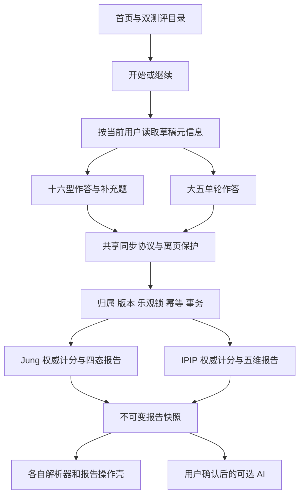
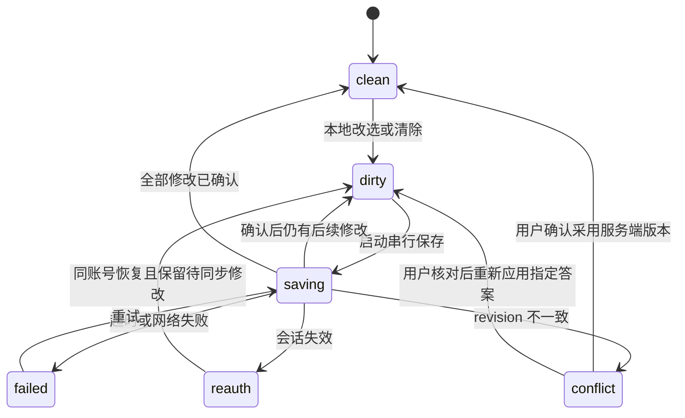

# TypeMe 优化详细设计

日期：2026-09-23。状态：待实施设计；示例接口、组件、表和用例均不代表已存在。

配套：[优化方案](01-优化方案.md) · [源码证据与验证](03-现状核查与验证记录.md)。任务 S01–S20、事实 F01–F19 和参考 R01–R10 沿用配套文档。

## 1. 设计边界与依赖

保留现有 URL 和既有客户端契约，采用增量接口与组件替换。旧 IPIP/OEJTS、本次十六型、新版大五作为三个兼容边界。共用账号、同步协议、报告壳；各量表继续独立定义题型、完成规则与报告体。



实施依赖：先明确错误/分页/同步契约，再接页面；先修创建事务边界，再做重试故障验证；先统一报告展示模型，再接导出与比较；先测量查询，再决定数据库投影。

## 2. 页面结构与导航

### 2.1 首页、目录与开始页

保留 `/`、`/instruments`、`/assess`，新增“我的测评”可使用 `/my/assessments`，复用草稿列表组件；不为重命名而删除已有入口。

首页由四块组成：产品定位和选择入口、本人最近草稿（登录后）、双测评卡片、示例和方法。现有 PersonalityGallery 与十六型详解降到专题区或测评详情，不让它们替代大五的结果示例。

开始页需要区分：

| 状态 | 页面动作 |
|---|---|
| 目录加载失败 | 重试目录；保留已载入的草稿 |
| 草稿查询中 | 显示“正在确认上次进度”，暂不自动创建 |
| 草稿查询失败 | 重试进度；明确点“另开一次”才可新建 |
| 同量表存在草稿 | 默认“继续作答”，列出时间与进度；另开一次为次要动作 |
| 确认无草稿 | 显示测前说明与“开始这一项” |
| 新建结果未知 | 保留本次操作标识并重试/恢复，不能换键静默再建 |

入口行为抽成 `useStartAssessment` 或独立 store action，供首页、目录、选择页、报告复测共用。按钮显示 loading 的同时，action 内也检查是否已有未完成调用。

### 2.2 答题页线框

```text
[返回我的测评]      大五人格倾向测评
已处理 18 / 50      有 1 题尚未同步 · 重试
------------------------------------------------
第 19 题
我通常提前做好准备。
[如何理解这句话 ▾]

[很不符合] [不太符合] [一般] [比较符合] [很符合]
[这题我说不好]      已选：比较符合

[查看答题卡]                         [上一题] [下一题]
------------------------------------------------
底部安全区和操作栏实际占位
```

这是结构示意，实际选项文案继续使用内容包/现有锚点；不能直接把示意词替换进正式量表。十六型保留左右场景，移动端可上下摆放两端描述，但五档含义不变。

题号表示当前位置，进度表示已处理数量，两者分开。补充题开始后展示“主测已完成；补充 1/8”，不把 48 的分母突然改成 56。

选后不自动跳题。数字键、方向键和 Enter 需要在输入框、radiogroup、弹窗之间分配：方向键在选项组内仅改选；Enter 在推进区域触发下一步；弹窗开启时全局作答快捷键暂停。帮助默认折叠，不能泄露“选这个就是某一类型”。

### 2.3 报告页线框

```text
测评名称 · 本次作答时间                      [回到历史]
本次摘要
十六型：状态 + 参考类型/并列说明
大五：五个维度各自的方向与缺失说明
[复制摘要] [保存图片] [更多操作]

这次可以怎样理解（边界与作答覆盖）
四维/五维解释
一个可以在生活里观察的行动
详细解读（分节、按需展开）
AI 分析（可选、独立状态）
来源、版本和方法（折叠，但重要限制在摘要处也出现）
```

摘要不能用“可靠度 90%”。覆盖信息只说明答了多少、哪些维度不足；类型/分数本身的测量解释仍保留限制。危险操作放在“更多操作”或页尾，默认不与复制和下载等安全动作并排强调。

### 2.4 登录、账号和管理

复用现有 FormErrorNotice、ConfirmDialog 和路由安全回跳。表单错误对应字段并可聚焦，失败后保留用户名等非敏感字段；密码、恢复码按当前安全策略处理。注册必须说明邀请码和当前数据保存范围。

账号页分资料、安全和数据；管理员页分成员、邀请、AI 设置。只改善现有功能的加载、防重复提交和错误反馈，不借本轮扩展管理员查看数据的权限。保存状态绑定具体表单，避免“改昵称”锁住整个账号页。

## 3. 按钮与交互组件

### 3.1 AppButton

建议新增 `frontend/src/components/AppButton.vue`，保留现有 CSS 类，渐进替换高频页面。

```typescript
type ActionState = 'idle' | 'pending' | 'success' | 'error'
interface AppButtonProps {
  variant?: 'primary' | 'secondary' | 'ghost' | 'danger'
  size?: 'normal' | 'small'
  type?: 'button' | 'submit' | 'reset' // 默认 button
  state?: ActionState
  disabled?: boolean
  pendingLabel?: string
  describedBy?: string
}
```

规格：

- 用原生 button 执行操作，RouterLink 承担导航。不要把链接伪装成可禁用按钮却仍可跳转。
- pending 时拦截再次触发并设置 aria-busy；文字保留上下文，宽度避免因图标切换明显跳动。
- disabled 原因通过邻近文本或 aria-describedby 给出；不能只用 hover tooltip。
- success/error 的内容由调用方提供，不能按 Promise resolve 自动假定业务成功。
- 输出结果交给 `ActionFeedback`，局部成功用 polite 状态区，严重失败用 alert，避免每次改选都打断读屏。
- 必须留有 finally 恢复路径；取消、过期响应与卸载也要处理。

### 3.2 选项、弹窗与操作栏

| 组件 | 责任 | 复用策略 |
|---|---|---|
| LikertScale | 单选、标签、方向键、roving tabindex | 保留现有实现；适配十六型时传明确双极锚点，不能套用大五词汇 |
| ConfirmDialog | 初始焦点、Tab 循环、Esc、恢复焦点、背景滚动控制 | 大五离页改为复用；区分取消、确认和 busy |
| AnswerSaveStatus | 同步状态、未保存数、重试或登录入口 | 两种测评相同语义，分别映射各自 store |
| AssessmentActionBar | 上一题、下一题/检查提交、答题卡 | 只发事件，不计分、不直接请求 API |
| ReportActions | 复制、下载、复测、比较入口 | 根据报告能力配置动作，不把大五当十六型 |

主要点击区设计为至少 44×44 CSS px，普通主按钮沿用现有 48/52px；最低标准和间距例外参考 R01，模态焦点行为参考 R02。测试计算实际可点击区域，不只检查 class 名。

## 4. 同步状态与离页保护（S01、S06）

### 4.1 状态模型

业务阶段与保存状态分离。主测/补充/已提交是测评阶段，不能和 saving/conflict 混成一个巨型枚举。

```typescript
type SyncState =
  | { kind: 'clean'; lastConfirmedAt: string | null }
  | { kind: 'dirty'; pendingCount: number }
  | { kind: 'saving'; sentLocalSeq: number; pendingCount: number }
  | { kind: 'failed'; pendingCount: number; errorCode: string }
  | { kind: 'conflict'; pendingCount: number; serverRevision: number | null }
  | { kind: 'reauth-required'; pendingCount: number }

type AnswerValue =
  | { kind: 'RATING'; rating: 1 | 2 | 3 | 4 | 5 }
  | { kind: 'UNKNOWN'; rating: null }
  | { kind: 'CLEAR'; rating: null } // 仅操作；持久化后是不存在

interface PendingChange {
  questionId: string
  value: AnswerValue
  localSeq: number
}
```

未处理 = answers 中无该题；UNKNOWN 是明确回答；3 是有效中间档。两套引擎对“有效覆盖”的要求各自定义。



### 4.2 保存算法

1. 每次编辑更新页面内 answers，为该题生成递增 localSeq，并登记 pending；CLEAR 同样登记。
2. 为每份 attempt 维护一个 inFlight Promise。已有请求时只更新 pending，不并发发送相同 expectedRevision。
3. 发送时复制 pending 快照、题目指针、当前 serverRevision 和 ownerGeneration。
4. 2xx 返回后，先确认用户、attempt、generation仍匹配；只清理 localSeq 等于已发送版本的题目。
5. 更新 serverRevision。还有 pending 就继续下一轮，否则显示已保存。后续成功不能掩盖前一条失败。
6. 网络失败保持 pending；401 进入重新登录；CONFLICT_REVISION 冻结保存，等待用户核对。
7. ATTEMPT_SUBMITTED、PACKAGE_UNAVAILABLE 与 IDEMPOTENCY_IN_PROGRESS 不能全部当成“另一台设备改过”；按 error.code 精确分流。

选项点击立即本地反馈。可以在短合并窗口（建议 250–400ms，实施时测量）后保存；下一题、提交、页内离开触发 flush。大五不再必须等每次保存往返才切题。这个窗口只减少请求，不改变最后答案。

题目指针也版本化：先算目标题并登记，再由同一保存队列写出。目标是刷新后恢复到用户当前正在看的题。指针保存失败仅提示恢复位置可能滞后，不能把已确认答案说成未保存。

### 4.3 离开与登录失效

新增 `useUnsavedAnswersGuard`，接口可接收 `hasPendingChanges()`、`flush()`、`pendingCount()`、`discard()`。页面通过 ConfirmDialog 展示选择。

- 路由离开和同路由 attemptId 切换都必须守卫；外层 AttemptRouter 决定组件的情况下，把守卫注册在实际路由层或可证明能拦截更新的共用入口。
- 保存有进展则等待；超过配置时限后允许用户留在当前页重试或明确离开。时限不会取消服务端已收到的提交，返回结果仍需代次校验。
- 只有本地未同步答案时注册 beforeunload，清空后立即移除；它是提醒，移动端强杀仍可能丢失内存改动，见 R10。
- 401 后在同页重新登录能保留内存改动；若沿现有登录路由跳转，必须先隔离 pending，返回后确认仍是原账号并重新读取 revision，再让用户应用。切换账号就清理，不把前一个账号的答案带给后一个账号。
- 默认不把原始答案写入 localStorage/IndexedDB。若未来要离线恢复，应另行明确用户知情、共享设备清理、保留期与风险。

### 4.4 冲突核对

沿用十六型 lostAnswers 的已有经验。将本机未同步更改保留在临时内存快照；读取服务端最新版本仅用于对比，读取失败时不能清掉本机内容。

界面显示题号、题面、服务端选项、本机选项和清除动作。默认采用服务端；用户可逐题选择重新应用本机答案。重新应用是基于用户看到的最新 revision 发起一次新 PATCH，如果期间再冲突就重新核对，禁止静默重试覆盖。

冲突快照只属于当前账号和当前 attempt；成功解决、退出账号或明确放弃后清除。

## 5. 创建、列表与分流接口（S02–S04、S10）

### 5.1 前端创建幂等

复用 `api/v3.ts:newIdempotencyKey`。大五 store增加与十六型相同的 createKey 生命周期：开始一次新意图时生成，网络超时/5xx/响应解析失败重试沿用，确认创建结果后清除；用户明确另开一次时才创建新键。

保持按钮锁和 action 重入锁。首次调用与重试请求体必须一致。发布期间如果默认包变化导致服务端指纹不一致，明确显示版本已变化并要求重新确认开始，不能吞掉 IDEMPOTENCY_KEY_REUSED 再自动换键。

首批键存页面/store内存。刷新后应先查询本人草稿再恢复；若要求刷新跨越未知响应仍严格复用同键，可增加仅包含操作标识、量表 slug 和创建时间的 sessionStorage 待办记录，按账号隔离并清理，不保存答案或凭据。这属于第二批能力，首批验收不宣称已解决浏览器关闭后的全部重放情况。

### 5.2 API 增量契约

| 接口 | 状态 | 变化 |
|---|---|---|
| GET /api/v3/platform/attempts | 已有，扩展 | 增加 scope=open/all、instrument 可选；过滤在分页之前 |
| GET /api/v3/platform/reports | 已有，扩展 | 增加 instrument 可选；保留 page/size/total |
| GET /api/v3/platform/attempts/{id}/meta | 新增 | 中性元信息；两种测评可读，先校验归属 |
| POST /api/v3/attempts | 已有 | 十六型创建；兼容原契约，内部修复幂等事务 |
| POST /api/v3/platform/attempts | 已有 | 大五创建；前端必须传本次意图的 Idempotency-Key |
| GET /api/v3/platform/reports/compare | 后续新增 | 两份报告的通用比较外壳；旧十六型比较接口保留 |

meta 响应示意：

```json
{
  "schemaVersion": 1,
  "attemptId": "<attempt-id>",
  "instrumentSlug": "bigfive50",
  "instrumentKind": "big_five",
  "packageId": "typeme-bigfive50-zh-v1",
  "status": "BASE_IN_PROGRESS",
  "revision": 12,
  "reportId": null
}
```

404 对“不存在”和“不属于本人”保持同形；不把 userId 作为可由客户端指定的所有者。未知 kind 显示不支持，不默认跳十六型。meta 成功后组件各自加载一次；后续如需进一步减少读取，可返回严格判别的联合详情并由两个专属解析器 adopt，不能传任意对象绕过校验。

### 5.3 列表查询与分页

首批保留 offset 分页，默认每页 20，后端最大 50。使用服务器 total 显示“共 X 份”，页面内种类计数只能叫“本页 X 份”。筛选重置 page并取消/隔离旧响应；删除当前页最后一条后在合法页重新读取。

草稿 scope=open 显式映射允许继续的状态，不能简单 `status != SUBMITTED` 把未来删除中/无效状态放进来；枚举清单实施时与两个服务端状态机核对。旧调用不传 scope 保持原行为。

SQL 草稿示意（非可直接执行迁移）：

```sql
SELECT a.id, a.package_id, a.status, a.revision, a.updated_at
FROM assessment_attempt a
JOIN assessment_package p ON p.package_id = a.package_id
WHERE a.user_id = :currentUser
  AND a.status IN (:openStatuses)
  /* 按需追加 p.instrument_id = :instrumentId */
ORDER BY a.updated_at DESC, a.id DESC
LIMIT :size OFFSET :offset;
```

所有值使用参数绑定；动态部分仅来自服务端白名单。COUNT 使用同一过滤条件。回答数量和关联报告可按页面 IDs 批量取，先记录执行计划再决定是否替换现有子查询。

offset 超大成为瓶颈后再引入 cursor，游标使用时间 + id并绑定筛选上下文；保留旧接口兼容。草稿会被更新，跨页可能移动，前端按 id去重并提供刷新；不能承诺可变列表具有事务快照一致性。

## 6. 创建事务与幂等（S05）

### 6.1 当前风险与目标

当前两个 create 流程内部直接调用带 `@Transactional` 的 createOnce，资源创建后再调用 complete并吞掉其异常。源码可以确认调用结构；代理模式的同类调用不建立预期事务，依据 R03。是否已造成线上重复或半完成数据，本轮没有运行证据。

目标是“同用户、同操作、同键、同请求内容，在有效期内始终返回同一资源”。不再接受“资源建成但幂等完成失败后下次可能再建”的窗口。

### 6.2 建议实现

对同步、短时的草稿创建单独引入 `AttemptCreationWriter`，参照现有 `AnalysisCreationWriter` 的跨 bean事务模式。采用**占用幂等键、插入 attempt、标记完成三步同一短事务**，由唯一约束解决并发：

1. 应用服务先规范化请求与键，做只读身份/内容/来源校验；构造现有版本兼容的 requestHash。
2. writer代理开启事务，尝试插入该键的幂等记录，然后创建 attempt，最后更新 response_ref/COMPLETED；更新行数必须为 1。
3. 任一步异常全部回滚，异常传出，不吞掉完成标记错误；事务成功后才能返回创建结果。
4. 同键并发插入触发唯一约束：让失败事务完整结束，再在新读事务查询已完成记录。不能在已标记回滚的事务中继续读写并宣称成功。
5. 请求内容相同返回已有资源；不同内容返回 IDEMPOTENCY_KEY_REUSED。锁等待超时或另一请求仍处理中返回可识别的重试错误，保留原键。
6. 无键的旧客户端暂时仍兼容，但不提供重复新建的幂等保证；新前端两类创建都必须有键。

这一设计限于短事务，不把 AI 上游调用或长任务包进数据库事务。无需因为这项修复重写整个 IdempotencyGuard，先建立创建专用原子操作，其他使用方逐个评估。

### 6.3 旧记录与上线

COMPLETED 记录继续重放。旧 IN_PROGRESS 记录可能来自历史三段流程，不能单凭超时盲目新建；先按已知 response_ref恢复，没有映射的情况返回明确的恢复提示。部署采用停止旧创建入口/排空在途请求后切换，或设计有 fencing 的所有权协议；不让新旧两种占用流程同时处理同一键。

清理任务不得删除正在执行新短事务的记录。真实 MySQL 上需要验证唯一键等待、隔离级别可见性、死锁重试和清理并发。H2验证不能替代这一步。

### 6.4 提交不变量

两类现有提交均保留 attempt 行锁、expectedRevision校验、报告唯一约束以及固定快照。修改只为补回归和准确错误分支，不重新发明报告提交。

PATCH 与 submit交错必须串行：先拿到行锁的一方确定结果；已提交后 PATCH明确返回 ATTEMPT_SUBMITTED。网络超时重试submit返回既有reportId，前端可先只读查询 attempt/report恢复。

## 7. 报告模型、导出与比较（S12、S13）

### 7.1 模型边界

保留已存在的报告 envelope与两类严格解析器。公共展示模型使用判别联合，不能把一切变成可选字段：

```typescript
type Presentation =
  | { kind: 'jung_reference'; common: ReportHeader; body: JungReportViewModel }
  | { kind: 'big_five_profile'; common: ReportHeader; body: BigFiveReportView }

interface ReportHeader {
  reportId: string
  createdAt: string
  instrumentTitle: string
  reportHash: string
  limitations: string[]
}

interface ReportExportModel {
  kind: Presentation['kind']
  title: string
  summary: string
  dimensionLines: string[]
  limitationLines: string[]
  filename: string
  altText: string
}
```

类型示意中的名称是新适配层，映射现有字段而非修改历史快照。未知schema显式“不支持此版本”；旧包下线也优先读已保存快照，不套当前算法重算。

### 7.2 共用报告动作

报告解析 → 量表专属导出适配器 → 文本/Canvas/文件名/alt。大五导出永远无类型码；十六型 TIED不出现完整类型，自我选择与计算结果分开。复用已有绘图工具前检查其模型是否只适用于旧量表。

下载动作新增独立 downloading guard、try/finally和可读失败。生成图片时不要依赖跨域远端插画才能完成，优先纯文本和本地矢量图；导出只显示经过确认的报告内容，不嵌入账号标识、答案明细或 AI近况。对象URL释放时机与离页清理一起测试。

### 7.3 比较

初版仅允许同用户、同量表、同 packageId + scoringVersion的两份报告数值比较；报告内容版本不同但量尺完全一致的放宽要通过兼容表明确记录，默认从严。Jung v3与v4即使题面一致也先标为“规则不同，不直接给变化结论”。

- 十六型显示每维差异、边界/平分状态和补充题信息，不把字母变了叫成长或退步。
- 大五显示同维分数A/B及差值；任一份该维无结果，差值为null，原因是作答信息不足。
- 不同量表只支持并列阅读，绝不把大五E换算为Jung E。
- delta只是两次自报变化，不宣称显著变化、能力变化或治疗效果。

比较响应示意：

```json
{
  "comparable": false,
  "reasonCode": "SCORING_VERSION_MISMATCH",
  "reportIds": ["<report-a>", "<report-b>"],
  "differences": [],
  "notice": "这两次使用的解释规则不同，建议分别阅读。"
}
```

## 8. 计分与内容工程（S15、S18、S19）

### 8.1 十六型规则固定

```text
单题：c = direction × (rating - 3)
维度：S = Σc；n = 数字回答数量；m = S / (2n)
主测覆盖：48题均处理，每维主测数字回答 ≥9
当前 v4：T(n) = B(n) = floor(2n/5)
覆盖不足 → NEEDS_REVIEW，不生成有效报告
覆盖足够且任一最终维度 S=0 → TIED
否则任一维 |S|≤B(n) → TENTATIVE
否则 → REFERENCE
```

review冻结补充维度，后续修改主测是否使review失效遵守既有契约，不能只改前端进度。补充题只进入已安排维度；跳过保留明确标记。n为0不计算m、不宣称“倾向为0”。

回归至少覆盖 n=9/12/16的阈值邻接格、等号、全unknown、未处理、全中立、正反端点、跳过补充、并列、旧版本v1/v2/v3/v4、未知版本拒绝、TIED不推导过程。

### 8.2 大五规则固定

```text
正向题 corrected = rating
反向题 corrected = 6 - rating
每维 score = Σ corrected = constant + Σ direction×rating
constants：E=30，A=24，C=24，ES=48，O=18
每维10个数字回答：range=10..50，中点30
少于10个数字回答：score=null，方向=null
本版展示：|score-30|<6 接近中间
          6..10 略高/略低；≥11 更高/更低（文案取包）
```

这里的10–50针对当前每维10题、1–5反向求和规则，并不是所有大五量表通用范围。五维按固定顺序展示，各自解释；不计算总和。

删除或正确替换未使用的 `BigFiveScoringPolicy.rangeOf` 之前，补上反向键、五维所有极端组合、全中立30、单题unknown、无处理以及边界6/11的回归。主scorer已按题目端点计算量程，不能为了清理旧方法重写或重算历史数据。

### 8.3 当前生成链与新内容版本

| 内容 | 当前维护入口 | 生成/校验 |
|---|---|---|
| Jung初版题目与报告 | docs/2026-09-16/implementation/content 的YAML | convert-jung-content.mjs |
| Jung v2/v3/v4派生、可读文案、大五新包 | scripts/gen-platform-content.mjs | gen-platform-content.mjs --check |
| 大五中文题面与帮助基础 | backend/src/main/resources/assessment-packages/ipip50-zh1.yml | 平台生成器读取该源，再生成新测JSON |
| 旧量表前端副本 | 后端旧内容YAML | gen-fallback-content.mjs |
| Jung共享夹具 | scripts/gen-jung-fixtures.mjs | 三份夹具一致性检查 |

大五的新旧流程共享基础源，不能直接编辑已绑定 `ipip50-zh1.yml` 来发布新题面，否则会一并改变旧流程。新审校结果应新增独立候选源文件和新 packageId，显式登记来源，旧源继续冻结。是否继续通过生成器嵌入大段文案可后续迁到版本化YAML，迁移前后必须验证逐字与哈希一致，不能借搬家换内容。

建议新增内容发布清单 schema：

```typescript
interface ContentReleaseReview {
  packageId: string
  basedOn: string | null
  changes: ('wording' | 'help' | 'order' | 'scoring' | 'report')[]
  scoringVersion: string
  reportContentVersion: string
  sourceReferences: string[]
  reviewEvidenceIds: string[]
  validationState: 'draft' | 'language-reviewed' | 'pilot-complete' | 'evaluated'
  comparability: 'same-scale-reviewed' | 'not-established'
}
```

这些状态是建议工作流，不直接替换现有客户端枚举。语言审校完成不等于测量效度完成；兼容表必须有评审依据。

### 8.4 研究数据字典

准备与生产账号分离的研究导出规范：随机participantId、consentVersion、packageId/sha256、原始作答状态、题目理解反馈；如确需作答时长，单独说明采集用途。人口学变量按研究问题最少收集，不默认复制昵称/用户名/账号ID。

试测分析以维度和题目为单位，不能只看完成率。建议输出项目分布、unknown原因、反向题理解、修正项目相关、适合有序题的结构分析、内部一致性及区间、重测相关与类型边界稳定性。检测到快速作答或同一选项连选时仅作待核查信号，不能直接判定骗人或删答卷。

认知访谈、试测人数与正式研究样本量见优化方案第10节；精确样本数由模型与精度设计，不在代码里写一个“达到300人即验证完成”的开关。

## 9. 数据模型与查询优化（S16）

第一批分页和过滤可使用已有表与索引，无需默认执行DDL。计分方法和报告正文不需要为页面分页迁移。

如果测量证实 report_json列表解析是瓶颈，建议新增可重建 `report_list_projection`（待迁移评审），不在历史assessment_report上重写正文。

| 字段 | 建议类型 | 说明 |
|---|---|---|
| report_id | CHAR(36)，主键/外键 | 一份报告一行；删除时随报告清理 |
| user_id | CHAR(36) | 服务端从报告写入，查询仍按归属过滤 |
| instrument_id / instrument_slug | VARCHAR(64) | 同时保留内部标识和目录映射，避免二者混淆 |
| report_kind | VARCHAR(32) | jung_reference / big_five_profile |
| package_id / scoring_version | VARCHAR(64) | 来源版本 |
| result_status | VARCHAR(32) | 各量表原状态 |
| summary_text | VARCHAR(1000)或经实测确定长度 | 从快照提取，不能调用当前文案生成器重算 |
| created_at | DATETIME(6) | 源报告时间 |
| source_report_hash | CHAR(64) | 防止投影与快照错配 |
| projection_schema_version | INTEGER | 投影规则版本 |

新报告同事务写投影；旧报告通过批准后的限批、可重入任务提取。投影缺失时暂时回退旧读法；出现hash不符则拒用投影并记录低敏告警。回退应用时保留投影表，停止读取即可，不能反向删报告。

迁移命名使用实施时仓库下一个空闲版本号，不能提前锁死V11。已有迁移不改写。本轮不生成或执行迁移SQL。

索引先审查已有 `idx_attempt_user(user_id,updated_at)`、`idx_attempt_user_status(user_id,status)`、`idx_report_user(user_id,created_at)` 以及报告attempt唯一键。InnoDB二级索引包含主键列，不能仅因ORDER BY有id就断言现有索引缺失，见R09。使用代表性合成数据与EXPLAIN决定新增或保留，评估写入开销和存储。

## 10. 前端与运行性能（S11、S17、S20）

### 10.1 拆包

第一步对登录外的非首屏页面、报告、比较、账号、管理和旧流程用路由动态import，参考R04中的Vue资料。第二步移除App的全局旧quiz/旧fallback依赖，把旧署名与存储恢复放进旧流程边界；否则只改路由仍可能把大量旧内容留在首页包。

首页自己的示例与插画要保留首屏稳定尺寸；已有图片运行期映射和fallback机制先复用，不能重新把大图全部塞进bundle。首屏图片按优先级加载，非首屏画廊延后。当前 `chunkSizeWarningLimit:900` 是告警阈值，不是性能预算。

构建对比记录：首屏JS/CSS原始与gzip大小、是否仍含旧题库/管理模块、首屏请求数、核心页面的首次与二次导航耗时。未测量前不写“减少70%”。

### 10.2 缓存与AI轮询

公开目录/详情用已发布包哈希和目录配置构造ETag；图片映射必须包含更新时间或内容摘要。304处理要在API客户端先接好，否则现有readJson可能把空响应误判。账号、草稿、报告不使用共享公共缓存。

AI保留现有单请求在途和generation保护。候选策略为页面可见时3s起步、随后逐步到10s并少量抖动；页面隐藏时停止频繁轮询，恢复可见立即只读刷新一次。遇到429尊重Retry-After；任务达到前端等待上限显示“稍后回来查看”，不能把任务改成失败或自动新建任务。

### 10.3 性能与观测

建议字段：requestId、routeTemplate、instrumentKind、operation、duration、resultCode、payloadBytes。不得将真实reportId、userId、答案和备注作为高基数指标标签或明文日志内容；需要关联排障时用经过控制的追踪ID。

基线分层：源码证明依赖路径；构建产物证明拆包；实验室浏览器证明给定环境下加载；真实用户分组指标才能给出实际p75；数据库执行计划和负载验证证明查询表现。四者不能互相代替。

## 11. 测试与验收矩阵

所有以下用例均为实施验收要求，本轮未运行这些业务测试。

| 编号 | 情境 | 预期 |
|---|---|---|
| T01 | 选1后立即选5，第一个保存较慢 | 最终答案5；无伪409；已确认旧请求不覆盖新选择 |
| T02 | Q10保存失败，Q11保存成功 | Q10仍显示待同步，队列重试后才全部已保存 |
| T03 | 已选数字 → UNKNOWN → CLEAR | 服务端最终无该题记录，未处理数准确 |
| T04 | 保存失败后页内离开、同路由换attempt | 出现确认；取消留在原题；确认离开影响明确 |
| T05 | 有未同步修改时刷新/关闭 | 在支持的浏览器显示系统提醒；不能承诺移动强杀保护 |
| T06 | 大五创建已成功但响应丢失 | 同键重试同attemptId；同键不同请求被拒绝 |
| T07 | 两个客户端同键同时创建 | 仅一份attempt，资源与幂等记录一致 |
| T08 | 在创建后、幂等完成前注入异常 | 新设计整事务回滚；重试只创建一份 |
| T09 | 旧请求迟到、切账号、切测评 | 旧响应不污染新账号/新attempt |
| T10 | 两设备修改相同/不同题 | 409均不自动覆盖；用户看过对比后可重新应用 |
| T11 | 保存期间登录失效后重新登录 | 原账号可恢复待确认修改；不同账号不继承 |
| T12 | PATCH与submit并发、submit重复请求 | 一个不可变报告；提交后不可继续改答案 |
| T13 | 草稿排在第51条及更早，前50条均已提交 | open查询仍返回目标草稿 |
| T14 | 51/101份报告，筛选、末页删除 | 全部可达；总数正确；不重复、不留空死页 |
| T15 | 跨归属访问、CSRF缺失、普通用户访问管理 | 既有安全边界保持；不存在/他人资源不泄露 |
| T16 | Jung各版本全部共享夹具与阈值邻接格 | Java/TS一致；历史版本冻结；TIED无伪类型/过程 |
| T17 | 大五全中立、端点、反向、unknown和未处理 | 中立30、量程10–50、五维独立、不补分 |
| T18 | 同版本/跨版本/跨量表报告比较 | 只有许可组合有差值；缺失维度差值null |
| T19 | 复制、图片、文件名与alt | 同一模型、限制说明一致、无账号隐私泄露 |
| T20 | AI关闭、额度不足、超时、429、旧提示词 | 固定报告可读；无重复付费动作；恢复轮询准确 |
| T21 | 320/390/1440，键盘，200%缩放，长中文 | 无横向溢出和关键遮挡；弹窗焦点正确；主要动作可达 |
| T22 | 旧IPIP/OEJTS记录、未知报告schema、下线包 | 旧记录可读；无法支持时如实提示；不套新默认 |
| T23 | 摘要投影缺失/旧schema/hash不符 | 正确回退或拒用；报告原快照不变 |
| T24 | 同一UTC时间在草稿、列表、详情和导出 | 本地格式一致，无法解析时不显示错误日期 |

验证入口：

```powershell
# 根目录，只读检查
node scripts/gen-fallback-content.mjs --check
node scripts/rewrite-types-content.mjs --check
node scripts/check-type-duplication.mjs
node scripts/convert-jung-content.mjs --check
node scripts/gen-jung-fixtures.mjs --check
node scripts/gen-platform-content.mjs --check

# frontend：实施后按实际影响选定向测试，再执行需要的回归
npm.cmd run typecheck
npm.cmd test
npm.cmd run build

# backend：先确认JDK21、测试配置与新增测试副作用
mvn.cmd test '-Dtest=*,!AccountSqlDialectMySqlIT,!AiSqlDialectMySqlIT,!ConcurrencyMySqlIT'
```

npm test/build的前置生成器可能写旧内容副本，执行前确认工作区。后端上述命令只是排除三类真实MySQL测试的子集，不能叫完整MySQL验证。真实MySQL、迁移和经接口写现有数据必须另有具体目标授权。

浏览器首先使用合成数据和全拦截API验证交互；集成验证再使用隔离且获授权的目标。模拟接口可以证明按钮与页面流程，不能证明后端提交成功。整站jar验收先构建前端，再打包，核对静态资源哈希与对应提交。

## 12. 文件级实施清单与完成定义

| 工作包 | 主要文件/建议新增 | 完成定义 |
|---|---|---|
| 同步和离页 | views/AssessView.vue、BigFiveAssessView.vue、AttemptRouterView.vue；stores/assessmentV3.ts、bigFiveV3.ts；建议composables/useUnsavedAnswersGuard.ts | T01–T05、T09–T11通过 |
| 创建幂等 | AssessChooserView.vue、bigFiveV3.ts、platformV3.ts；AttemptService、BigFiveAttemptService；新增AttemptCreationWriter | T06–T08通过，事务和兼容说明明确 |
| 列表与分流 | ReportsListView.vue、AssessChooserView.vue、AttemptRouterView.vue；PlatformController、PlatformDtos、PlatformQueryService | T13–T15通过；旧接口行为保留 |
| 按钮和壳 | App.vue、style.css、ConfirmDialog、LikertScale；新增AppButton/AnswerSaveStatus/ReportActions | T21通过，异步动作与导航语义清楚 |
| 报告 | ReportV3View.vue、BigFiveReportView.vue、CompareView.vue；domain/reportV3.ts和platform解析器 | T18–T19、T22、T24通过 |
| 内容和计分 | Jung/BigFive scorer、policy、内容生成器、共享夹具；候选内容源另建版本 | T16–T17通过；审校与版本记录独立齐全 |
| 性能与数据库 | router、App旧依赖、AI store、PlatformQueryService；必要时新增投影迁移 | 基线对比可复现，T20/T23通过，无猜测的收益数字 |

每包交付需包含：变更与事实依据、实际执行命令及退出码、失败/跳过项、脱敏浏览器证据、对旧版本的影响、必要的发布/回退步骤。实施顺序按优化方案批次A–E推进；本文件本身不触发应用部署或数据变更。
